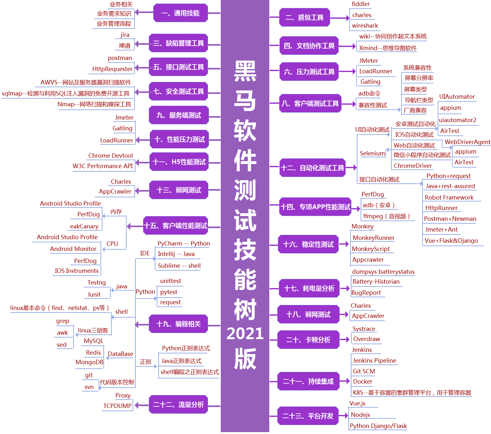
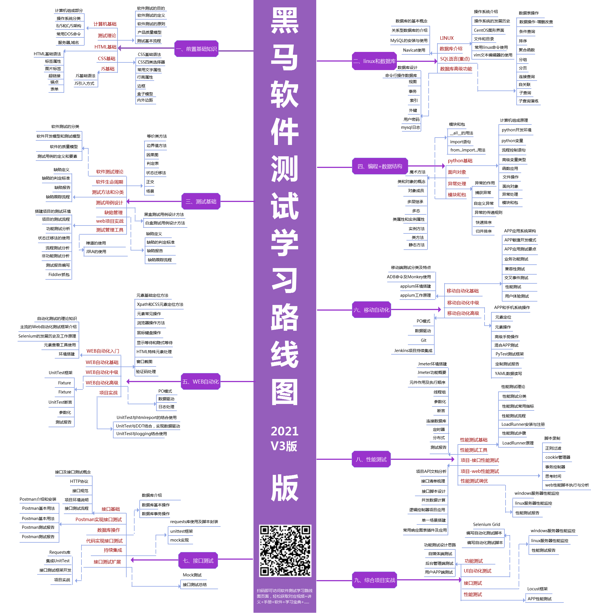
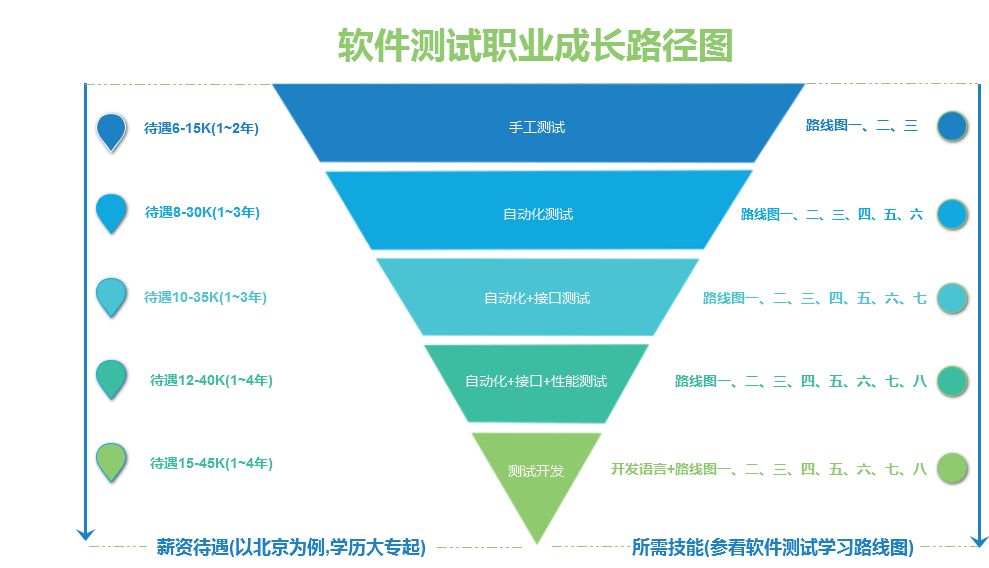
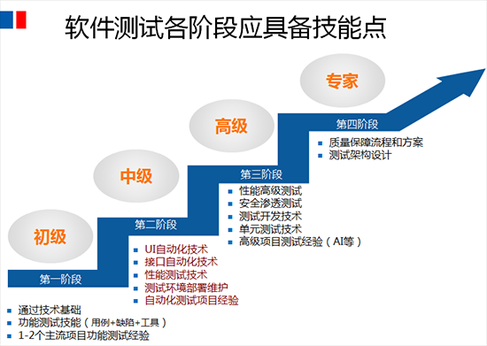

# 2021软件测试学习路线图

> 2021软件测试学习路线图,内附视频教程+自学路线+工具+面试篇-黑马程序员技术交流社区
> http://bbs.itheima.com/thread-405757-1-1.html

[Toc]

## 软件测试技能树-2021版


## 软件测试学习路线图-2021-V3版


## 软件测试职业成长路径图


## 初高级测试


## 软件测试岗位和薪资


## 软件测试各阶段应具备技能点


## 其它问题记录

> Excel怎么快速提取单元格内的超链接地址
> https://baijiahao.baidu.com/s?id=1640649015306258072&wfr=spider&for=pc

```vbscript
# 代码区域：
Function GetAdrs(Rng)
Application.Volatile True
With Rng.Hyperlinks(1)
GetAdrs = IIf(.Address = "", .SubAddress, .Address)
End With
End Function
```

