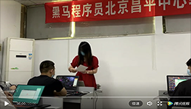
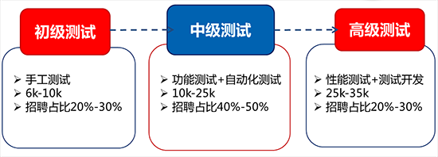

# [2021软件测试学习路线图,内附视频教程+自学路线+工具+面试篇](http://bbs.itheima.com/thread-405757-1-1.html)  

© [huawei](http://bbs.itheima.com/home.php?mod=space&uid=222085) [黑马粉丝团](http://bbs.itheima.com/home.php?mod=spacecp&ac=usergroup&gid=35)  / 2018-6-11 10:40 / 360100 人查看 / 1729 人回复 /  [54 人收藏](http://bbs.itheima.com/home.php?mod=spacecp&ac=favorite&type=thread&id=405757&formhash=e940d40d) 转载请遵从CC协议 禁止商业使用本文

| *本帖最后由 huawei 于 2021-10-22 16:27 编辑*  **本**[**软件测试学习路线图**](http://bbs.itheima.com/thread-405757-1-1.html?xhw)**内容丰富，但PC端访问更友好****移动端学员可点击访问**[**黑马B站版软件测试学习路线图**](https://www.bilibili.com/read/cv11893234)** ****软件测试学习路线图2021年日志****更新记录****：**更新软件《[小程序虚拟机(已配项目)_12楼](http://bbs.itheima.com/forum.php?mod=redirect&goto=findpost&ptid=405757&pid=3564314)》(21.10.22)更新薪资《[北京34期就业率91.%,均薪13k+](http://bbs.itheima.com/thread-512289-1-1.html?xhw)》(21.10.18)更新集合《[2021软测学员就业案例集合贴](http://bbs.itheima.com/thread-440526-1-1.html?xhw)[》(21.10.13)](https://www.bilibili.com/video/BV1bg411V7pp)视频集合《[听38期同学们讲选报测试故事](http://bbs.itheima.com/thread-512211-1-1.html?xhw)》(21.10.12)添加视频《[从0基础到自动化测试系列教程](https://www.bilibili.com/video/BV1bg411V7pp)》(21.9.9)想报免费自学群？戳此了解[**黑马测试自学群喊你入群了**](http://bbs.itheima.com/thread-507643-1-1.html?xhw)** ******[↑想查看最前沿课程大纲，手机用户点击本文字链即可跳到测试学科站↑](http://test.itheima.com/?testzlybxhw) **软件测试学习路线图制作者的话（必读）：**            软件测试学科作为一个2017年10月份成立的黑马新学科，到今天为止，我们已经顺利毕业了几十期学员。2018年6月我开始创建软件测试学习路线图，但到了2020年，我却遗憾发现，网上测试自学视频依然非常少，在贴吧，在知乎，仍然有大量自学的朋友因为找不到权威、系统的自学视频而苦劳。     为了让自学者们得到更贴合市场、更权威的测试学习资料，我向黑马申请到了很多新视频。作为一名讲师，很骄傲能给广大自学者提供一个这样优秀的学习资源（偷笑）。不用理解我整理的辛苦，不用理解我整理时累的都流眼泪了，大家觉得有用，拿去就是（点击蓝色连接会直接跳转到百度网盘）。     如果你觉的我整理的学习路线图非常有用，非要感谢我，那就在路线图最[**下方回帖留言**](http://bbs.itheima.com/thread-405757-9-1.html?xhw)吧（**已经1700+**），留下你对测试学习路线图的评价，让更多人看到它的价值。你的点赞是我持续输出干货的动力，感谢每一位点赞的朋友（我QQ是1944215794，有学习问题可私聊）。  **2021年9月重磅推出：****《软件测试系列教程_从入门到自动化测试，共****1024集【史上最全****】****》(共计6篇)** **6篇地址（每篇200集），下方蓝色文字带链接： [软件测试第一篇_测试理论_Linux数据库_超详细教程](https://www.bilibili.com/video/BV1bg411V7pp) [软件测试第二篇_功能测试+Python编程_超详细教程](https://www.bilibili.com/video/BV1QM4y137xX) [软件测试第三篇_接口测试_超详细教程](https://www.bilibili.com/video/BV11g411V7Kf) [软件测试第四篇_小程序测试_性能测试_超详细教程](https://www.bilibili.com/video/BV12Q4y1C7Wf) [软件测试第五篇_金融项目测试_超详细教程](https://www.bilibili.com/video/BV19Q4y167Qo) [软件测试第六篇_UI自动化测试_超详细教程](https://www.bilibili.com/video/BV18Q4y1y7v3) ** **2021年6月重磅推出：《**[**实战项目带小白入职7-12k功能测试岗位，仅7小时【史上最快】，测试大佬手把手教**](https://www.bilibili.com/video/BV1kw411o756)**》** **测试想高薪资必看：****《**[**测试工程师薪资，如何才能超过程序员？**](http://bbs.itheima.com/thread-509807-1-1.html?xhw)**》** **测试求职必看：《[测试人员面试失败，绝大部分死在这29个问题上](http://bbs.itheima.com/thread-508312-1-1.html?xhw)》**   **一、软件测试学习路线图—流程篇：** ----------------------------------------------------------[**推荐阅读：一贴让你知道测试职业到底有哪些发展方向**](http://bbs.itheima.com/thread-424438-1-1.html?xhw)---------------------------------------------------------- **下图如觉不清楚，请狠狠点击图片查看清晰版****点击查看大图** [**以上软件，请点击该链接查12楼工具篇-学软件测试所用软件**](http://bbs.itheima.com/forum.php?mod=viewthread&tid=405757&page=1#pid3564314) **二、软件测试学习路线图—视频篇：**     **1、第一阶段-5天****前置基础知识视频资源------------****--------------------------------------** [**楼层2**](http://bbs.itheima.com/forum.php?mod=redirect&goto=findpost&ptid=405757&pid=3554908)    **2、第二阶段-7天linux和数据库视频资源****------------****-------------------------------------** [**楼层3**](http://bbs.itheima.com/forum.php?mod=redirect&goto=findpost&ptid=405757&pid=3554911)    **3、第三阶段-10天测试基础视频资源****------------****------------------------------------------****[楼层4](http://bbs.itheima.com/forum.php?mod=redirect&goto=findpost&ptid=405757&pid=3554927)**    **4、****第四阶段-10天编程+数据结构****------------****---------------------------------------------**[**楼层5**](http://bbs.itheima.com/forum.php?mod=redirect&goto=findpost&ptid=405757&pid=3554935)    **5、****第五阶段-8天WEB自动化视频资源****------------****-----------------------------------------**[**楼层6**](http://bbs.itheima.com/forum.php?mod=redirect&goto=findpost&ptid=405757&pid=3554993)    **6、****第六阶段-12天移动化测试视频资源****------------****----------------------------------------**[**楼层7**](http://bbs.itheima.com/forum.php?mod=redirect&goto=findpost&ptid=405757&pid=3555005)    **7、****第七阶段-8天接口自动化视频资源****------------****------------------------------------------**[**楼层8**](http://bbs.itheima.com/forum.php?mod=redirect&goto=findpost&ptid=405757&pid=3555273)    **8、****第八阶段-6天性能视频资源****------------****------------------------------------------ ------**[**楼层9**](http://bbs.itheima.com/forum.php?mod=redirect&goto=findpost&ptid=405757&pid=3555282)     **9、****第九阶段-6天项目综合实战****------------****-------------------------------------------------**[**楼层10**](http://bbs.itheima.com/forum.php?mod=redirect&goto=findpost&ptid=405757&pid=3564299)   **10、第10阶段-3个月测试开发****------------****--------------------------------------------------**[**楼层11**](http://bbs.itheima.com/forum.php?mod=redirect&goto=findpost&ptid=405757&pid=3564303) ** ****三、软件测试学习路线图—工具篇：**    **1、突击实战视频篇（小视频覆盖大知识）****------------****-------------------------------------**[**楼层11**](http://bbs.itheima.com/forum.php?mod=redirect&goto=findpost&ptid=405757&pid=3564303)    **2、工具篇-软件测试所用软件****------------****--------------------------------------------------**[**楼层12**](http://bbs.itheima.com/forum.php?mod=redirect&goto=findpost&ptid=405757&pid=3564314)    **3、****工具篇-软件测试各种****文档****------------****--------------------------------------------------**[**楼层13**](http://bbs.itheima.com/forum.php?mod=redirect&goto=findpost&ptid=405757&pid=3564951) **四、软件测试学习路线图—经验篇：**    **1、****工具篇-****学软件测试常见问题------------****------------------------------------------------**[**楼层14**](http://bbs.itheima.com/forum.php?mod=redirect&goto=findpost&ptid=405757&pid=3564959)    **2、经验篇-经验级技术文章----------------------------------------------------------------**[**楼层15**](http://bbs.itheima.com/forum.php?mod=redirect&goto=findpost&ptid=405757&pid=3564960)    **3、经验篇-学软件测试****是否可拿高薪?------------------------------------------------------**[**楼层16**](http://bbs.itheima.com/forum.php?mod=redirect&goto=findpost&ptid=405757&pid=3564961) **五、软件测试学习路线图—面试篇：**    **1、测试学员故事分享****---------------------------------------------------------------------****-**[**楼层17**](http://bbs.itheima.com/forum.php?mod=redirect&goto=findpost&ptid=405757&pid=3574144)    **2、面试宝典免费分享****---------------------------------------------------------------------****-**[**楼层18**](http://bbs.itheima.com/forum.php?mod=redirect&goto=findpost&ptid=405757&pid=3574401) **六、****欢迎对软件测试学习路线图进行点评****---------------------------------------**[**楼层19及以后**](http://bbs.itheima.com/forum.php?mod=redirect&goto=findpost&ptid=405757&pid=3574626)      **其他楼层正待开发中.......有问题随时联系下方QQ和微信** **曾经我自学时也淋过雨****现在有条件了也想为你撑会伞**  **测试薪资集合：**[转行测试必看_黑马软测学员就业案例集合贴【附视频+照片】](http://bbs.itheima.com/thread-440526-1-1.html?xhw) **自学党必看：**[为何有很多人不相信测试培训班能出优秀人才](http://bbs.itheima.com/thread-505148-1-1.html?xhw) **测试小白必看：**[学习软件测试必知的100个常见问题，从此贴开始](http://bbs.itheima.com/thread-507947-1-1.html?xhw) **答疑解惑：**[黑马是靠谱的测试培训机构吗？从23期学员对讲师们的评论谈起](http://bbs.itheima.com/thread-507353-1-1.html?xhw)   评分[参与人数 24](http://bbs.itheima.com/forum.php?mod=misc&action=viewratings&tid=405757&pid=3554356)黑马币 *+91*收起*理由* [943113832](http://bbs.itheima.com/home.php?mod=space&uid=545733)+ 5很给力](http://bbs.itheima.com/home.php?mod=space&uid=547150) [ganp](http://bbs.itheima.com/home.php?mod=space&uid=547150)+ 2很给力](http://bbs.itheima.com/home.php?mod=space&uid=547501) [hhhmmm0205](http://bbs.itheima.com/home.php?mod=space&uid=547501)+ 5很给力](http://bbs.itheima.com/home.php?mod=space&uid=547131) [1063395411](http://bbs.itheima.com/home.php?mod=space&uid=547131)+ 5很给力](http://bbs.itheima.com/home.php?mod=space&uid=544858) [ceshi_20210304](http://bbs.itheima.com/home.php?mod=space&uid=544858)+ 1很给力](http://bbs.itheima.com/home.php?mod=space&uid=543693) [tant](http://bbs.itheima.com/home.php?mod=space&uid=543693)+ 5 [powerjjg1](http://bbs.itheima.com/home.php?mod=space&uid=543402)+ 5 [zy2081](http://bbs.itheima.com/home.php?mod=space&uid=311782)+ 5 [不兴](http://bbs.itheima.com/home.php?mod=space&uid=542554)+ 2 [zqq1314](http://bbs.itheima.com/home.php?mod=space&uid=541452)+ 5路线图十分清晰，可以很明确的看出自己走到.[查看全部评分](http://bbs.itheima.com/forum.php?mod=misc&action=viewratings&tid=405757&pid=3554356) |
| ------------------------------------------------------------ |
| [*97*](http://bbs.itheima.com/forum.php?mod=misc&action=recommend&do=add&tid=405757&hash=e940d40d)*分享至 :*[QQ空间](http://bbs.itheima.com/#) [收藏](http://bbs.itheima.com/home.php?mod=spacecp&ac=favorite&type=thread&id=405757&formhash=e940d40d)*[回复](http://bbs.itheima.com/forum.php?mod=post&action=reply&fid=600&tid=405757&reppost=3554356&extra=&page=1) [只看该作者](http://bbs.itheima.com/forum.php?mod=viewthread&tid=405757&page=1&authorid=222085)* |
|                                                              |
|                                                              |

[测试](http://bbs.itheima.com/misc.php?mod=tag&id=22)[软件测试](http://bbs.itheima.com/misc.php?mod=tag&id=4670)

## **1729** 个回复

[倒序浏览](http://bbs.itheima.com/forum.php?mod=viewthread&tid=405757&extra=&ordertype=1)

| *[huawei](http://bbs.itheima.com/home.php?mod=space&uid=222085)* [黑马粉丝团](http://bbs.itheima.com/home.php?mod=spacecp&ac=usergroup&gid=35) *2018-6-11 15:19:10*\| [只看该作者](http://bbs.itheima.com/forum.php?mod=viewthread&tid=405757&page=1&authorid=222085)**[沙发](http://bbs.itheima.com/forum.php?mod=redirect&goto=findpost&ptid=405757&pid=3554908)***本帖最后由 huawei 于 2021-9-13 11:40 编辑*  **软件测试视频第一阶段-前置基础知识****本阶段软件测试课程共计5个知识点，1个免费视频涵盖****1、学习目标：****可掌握的核心能力：**1. 熟悉计算机相关概念；2. 掌握基础的测试理论；3. 熟练掌握HTML常用标签和语法规范；4. 掌握使用CSS定义网页样式；5. 掌握js的基本用法；**2、知识点:** **1）计算机基础**计算机组成部分、操作系统分类、B/S和C/S架构、常用DOS命令、服务器域名**2）测试理论**软件测试的目的、软件测试定义、软件测试原则、产品质量模型、测试基本流程**3）HTML基础**HTML基础语法、标签属性、图片标签、超链接、锚点、表单**4）CSS基础**CSS基础语法、CSS四类选择器、常用文字属性、行高属性、边框、盒子模型、内外边距**5）JS基础**JS基础语法、JS引入方式**3、该阶段免费配套视频**【默认文字链接为百度网盘地址】 1）北京校区-《[5天测试班基础视频教程2021版](https://pan.baidu.com/s/1tqoPVeYG8eWZuMotQdmRGg)》密码：e6yu （对应上述1-5知识点）    **本视频b站链接：**https://www.bilibili.com/video/BV1bg411V7pp  ----------------------以下为2020年视频------------------------1）北京校区-《[2019年视频告诉你测试行业薪资/价值/职业规划](https://pan.baidu.com/s/17w__bSFW6cVLt8DSLB_qnA)》 密码：qf4q（小白入门必看视频）    **本视频b站链接：**https://www.bilibili.com/video/BV1bV411d7LE2）北京校区-《[5天测试班基础视频教程2020版](https://pan.baidu.com/s/1xUDi_I3_Ysh70U7938XdrQ)》 密码：bnhw（对应上述1-5知识点）    **本视频b站链接：** https://www.bilibili.com/video/BV1Lt4y1m7W9-------------------------------------------------------------------------**推荐阅读：**《[教你“如何巧看黑马测试视频，悄悄成为测试高手?”](http://bbs.itheima.com/thread-508790-1-1.html?xhw)》 **测试小白必看****：**[秒杀自学党_黑马测试4.0课改带来的巨大变化，你真的知道？](http://bbs.itheima.com/thread-506686-1-1.html?xhw) **教你一招：**[如何挑选出比黑马还优秀的测试培训机构，绝对有用](http://bbs.itheima.com/thread-407131-1-1.html?xhw) **答疑解惑：**[黑马是靠谱的测试培训机构吗？从23期学员对讲师们的评论谈起](http://bbs.itheima.com/thread-507353-1-1.html?xhw)评分[参与人数 1](http://bbs.itheima.com/forum.php?mod=misc&action=viewratings&tid=405757&pid=3554908)黑马币 *+5*收起*理由* [943113832](http://bbs.itheima.com/home.php?mod=space&uid=545733)+ 5很给力 |
| ------------------------------------------------------------ |
|                                                              |
|                                                              |
| [回复](http://bbs.itheima.com/forum.php?mod=post&action=reply&fid=600&tid=405757&repquote=3554908&extra=&page=1)*举报[3](http://bbs.itheima.com/forum.php?mod=misc&action=postreview&do=support&tid=405757&pid=3554908&hash=e940d40d)[0](http://bbs.itheima.com/forum.php?mod=misc&action=postreview&do=against&tid=405757&pid=3554908&hash=e940d40d)* |
|                                                              |

| *[huawei](http://bbs.itheima.com/home.php?mod=space&uid=222085)* [黑马粉丝团](http://bbs.itheima.com/home.php?mod=spacecp&ac=usergroup&gid=35) *2018-6-11 15:22:01*\| [只看该作者](http://bbs.itheima.com/forum.php?mod=viewthread&tid=405757&page=1&authorid=222085)**[藤椅](http://bbs.itheima.com/forum.php?mod=redirect&goto=findpost&ptid=405757&pid=3554911)***本帖最后由 huawei 于 2021-9-13 11:18 编辑*  **软件测试视频篇第二阶段-linux和数据库****本阶段软件测试课程共计4个知识点，共计N个免费配套视频涵盖****1、学习目标：****可掌握的核心能力：**1. 掌握Linux操作系统按照和配置；2. 熟练掌握Linux常用命令；3. 掌握数据库增删改查操作；4. 熟悉数据库索引、视图、事务、常见函数等高级功能；5. 掌握Redis的string类型、hash类型、set类型、list类型等基本类型和操作；**2、知识点：****1）LINUX（熟悉）**操作系统介绍、操作系统发展历史、CentOS图形界面、文件和目录、常用LINUX命令使用、vim文本编辑器的使用**2）数据库介绍（熟悉）**数据库基本概念、关系型数据库介绍、MySQL安装与使用、Navicat使用**3）SQL语言（重点）**数据表操作、数据操作-增删改查、条件查询、排序、聚合函数、分组、分页、连接查询、自关联、子查询、子查询演练**4）数据库高级功能（了解）**数据库设计、命令行操作数据库、函数、存储过程、视图、事务、索引、外键、用户密码**5）redis****数据库功能（掌握）**掌握Redis的string类型、hash类型、set类型、list类型等基本类型和操作；**3、该阶段免费配套视频**【默认文字链接为百度网盘地址】1）北京校区-《[6天Linux 命令和数据库2021版](https://pan.baidu.com/s/17Ez29Ny7Rr4iXHUzcFqYyg)》            密码：1b7p（对应上述1-4知识点）   **本视频b站链接：**https://www.bilibili.com/video/BV1bg411V7pp ----------------------以下为2020年视频教程------------------------1）北京校区-《[2天linux视频2020完整版](https://pan.baidu.com/s/1VerralN8JLyE-5oYvlXWfw)》            密码：3e5z（对应上述1知识点）   **本视频b站链接：**https://www.bilibili.com/video/BV1vk4y1r7cW2）北京校区- 《[4天mysql视频教完整版分享2020版](https://pan.baidu.com/s/1jpXwfoaXeInvM0fokjTvoA)》 密码：6ca9（此免费视频对应上述2-4知识点）   **本视频b站链接：** https://www.bilibili.com/video/BV1gK411W7Y63）实战视频-《[1天redis实战视频教程2020版](https://pan.baidu.com/s/1igxz0D-xbFgAab4oBaWcxw)》       密码：eirg （此免费视频对应上述 5 知识点）   **本视频b站链接：**https://www.bilibili.com/video/BV1Mi4y147FD4）实战视频-《[Linux命令实战之Lnmp搭建禅道测试环境](https://pan.baidu.com/s/1An7uFAnRo4FigO3rLmSy1w)》      密码：479w （2018年课堂版本）   **本视频b站链接：**https://www.bilibili.com/video/BV18z4y1R7pQ5) 简历项目-《[如何在linux环境中使用Lnmp部署测试项目](https://pan.baidu.com/s/1vn9zIWWQdKVTIupA_jMetA)》     密码：zgbv （20年10.17日更新）  **本视频b站链接：**https://www.bilibili.com/video/BV1kD4y1d7Nr**----------------------------------------------------------****推荐阅读：**《[教你“如何巧看黑马测试视频，悄悄成为测试高手?”](http://bbs.itheima.com/thread-508790-1-1.html?xhw)》 **测试小白必看：**[学习软件测试必知的100个常见问题，从此贴开始](http://bbs.itheima.com/thread-406210-1-1.html?xhw) **【视频集合】**：[为什么要学软件测试,听听我们学员的声音](http://bbs.itheima.com/thread-452011-1-1.html?xhw) **测试求职必看：**[测试人员面试失败，绝大部分死在这下面29个问题上](http://bbs.itheima.com/thread-508312-1-1.html?xhw)评分[参与人数 2](http://bbs.itheima.com/forum.php?mod=misc&action=viewratings&tid=405757&pid=3554911)黑马币 *+10*收起*理由* [imwangqing](http://bbs.itheima.com/home.php?mod=space&uid=549002)+ 5很给力](http://bbs.itheima.com/home.php?mod=space&uid=545733) [943113832](http://bbs.itheima.com/home.php?mod=space&uid=545733)+ 5赞一个 |
| ------------------------------------------------------------ |
|                                                              |
|                                                              |
| [回复](http://bbs.itheima.com/forum.php?mod=post&action=reply&fid=600&tid=405757&repquote=3554911&extra=&page=1)*举报[4](http://bbs.itheima.com/forum.php?mod=misc&action=postreview&do=support&tid=405757&pid=3554911&hash=e940d40d)[0](http://bbs.itheima.com/forum.php?mod=misc&action=postreview&do=against&tid=405757&pid=3554911&hash=e940d40d)* |
|                                                              |

| *[huawei](http://bbs.itheima.com/home.php?mod=space&uid=222085)* [黑马粉丝团](http://bbs.itheima.com/home.php?mod=spacecp&ac=usergroup&gid=35) *2018-6-11 15:36:57*\| [只看该作者](http://bbs.itheima.com/forum.php?mod=viewthread&tid=405757&page=1&authorid=222085)**[板凳](http://bbs.itheima.com/forum.php?mod=redirect&goto=findpost&ptid=405757&pid=3554927)***本帖最后由 huawei 于 2021-9-22 15:17 编辑*  **软件测试视频篇第三阶段-测试基础****本阶段软件测试课程共计6个知识点，共计n个免费配套视频涵盖****1、学习目标：****可掌握的核心能力：**1. 掌握测试的基本概念和测试常见分类；2. 熟练掌握黑盒测试用例设计方法，进行功能测试用例设计；3. 熟练掌握缺陷报告的编写；4. 熟悉测试管理工具禅道和JIRA的使用5. 掌握项目测试流程；6. 掌握Web项目功能测试分析和用例编写；7. 熟悉测试计划，测试方案，测试报告的核心内容8. 掌握功能测试与数据库的关系9. 掌握Fiddler工具的使用**2、知识点：****1）软件测试理论**软件测试的分类，软件开发模型和测试模型，软件的质量模型，测试用例的定义和要素**2）****测试用例设计**等价类方法、边界值方法、因果图、判定表、状态迁移法、正交、场景**3)缺陷管理**缺陷定义、缺陷的判定标准、缺陷报告、缺陷跟踪流程**4)****Web项目实战**搭建项目的测试环境，如何快速熟悉项目，项目的测试流程，测试计划和方案，功能测试分析，状态迁移法的使用，流程测试分析，非功能测试分析，测试报告编写，Fiddler抓包**5)App****项目实战****6)测试管理工具**禅道的使用，JIRA的使用**3、该阶段免费配套视频**【默认文字链接为百度网盘地址】1）北京校区-《[功能测试_6天黑马手工测试2021版](https://pan.baidu.com/s/1WBJDI-Lwd9hvqI0fbzod-w)》 密码：ghpr （此免费视频对应上述1,2,3,4知识点）   **本视频b站链接**：https://www.bilibili.com/video/BV1QM4y137xX --------------------以下为2020年视频---------------------------1）北京校区-《[测试入门_3天黑马手工测试理论+6天实战完整分享_适合0基础](https://pan.baidu.com/s/1MTFmp4ZNmb7tHFeb3Kumqw)》 密码：ehlv （此免费视频对应上述1,2,3,4知识点）   **本视频b站链接**：https://www.bilibili.com/video/BV1at4y1Y7AN2）上海校区-《[移动端App测试_最新2020教学视频](https://pan.baidu.com/s/1SOjepE-_eKtVDc5ZORvIxQ)》20.12.6日更新 密码：gpin （此视频对应5知识点）    **本视频b站链接：**https://www.bilibili.com/video/BV12o4y1k7Kb3 ) 北京校区-《[1天禅道工具使用](https://pan.baidu.com/s/1znKa7LDUHePJ2_YyRXUtQQ)》 密码：e4n3 （此免费视频对应上述6知识点）   **本视频b站链接：**https://www.bilibili.com/video/BV1t541147Zk4) 北京校区-《[1天软件缺陷与JIRA](https://pan.baidu.com/s/11bmUSZ7M87oMiIYBdfz93A)》 密码：zx38（此免费视频对应上述6知识点）   **本视频b站链接：**https://www.bilibili.com/video/BV1DU4y1w7tX5) **实战视频**-《[两小时快速入门黑马头条APP功能测试实战](https://pan.baidu.com/s/1umbBhDka33r9PwRP5gQgHw)》 密码：36gj  **本视频b站链接：**https://www.bilibili.com/video/BV1oQ4y1N7E26)**实战视频**-《[实战项目带小白入职7-12k功能测试岗位，仅7小时【史上最快】](https://pan.baidu.com/s/1HHSrHHPY4FZtmO42JUdIoQ)》密码：yn8r **本视频b站链接****：**https://www.bilibili.com/video/BV1kw411o756  ------------------以下为2019年视频---------------------------1）北京校区-《[深入了解软件测试4天视频](https://pan.baidu.com/s/1H-S6WSDqz7JGu22otIe4CA)》 密码：ix15（此免费视频对应上述1,2,3知识点）   **本视频b站链接：**https://www.bilibili.com/video/BV1Jg4y1675r2）北京校区-《[4天学web手工项目测试](https://pan.baidu.com/s/1exdzBrsJsNd_3MZlWif4PQ)》密码：os3d（此免费视频对应上述4知识点）    **本视频b站链接**：https://www.bilibili.com/video/BV1pg4y1678g3）北京校区-《[2天学APP手工项目测试](https://pan.baidu.com/s/1JeItrcylRp2g078bFpNRTw)》 密码：1ehu（此免费视频对应上述5知识点）   **本视频b站链接：**https://www.bilibili.com/video/BV1JQ4y1N7Ad--------------------------------------------------------------------------**推荐阅读：**《[教你“如何巧看黑马测试视频，悄悄成为测试高手?”](http://bbs.itheima.com/thread-508790-1-1.html?xhw)》** 测试求职必看：**[测试人员面试失败，绝大部分死在这下面29个问题上](http://bbs.itheima.com/thread-508312-1-1.html?xhw) **测试小白必看：**[学习软件测试必知的100个常见问题，从此贴开始](http://bbs.itheima.com/thread-507947-1-1.html?xhw) **自学党必看：**[为何有很多人不相信测试培训班能出优秀人才](http://bbs.itheima.com/thread-505148-1-1.html?xhw) |
| ------------------------------------------------------------ |
|                                                              |
|                                                              |
| [回复](http://bbs.itheima.com/forum.php?mod=post&action=reply&fid=600&tid=405757&repquote=3554927&extra=&page=1)*举报[5](http://bbs.itheima.com/forum.php?mod=misc&action=postreview&do=support&tid=405757&pid=3554927&hash=e940d40d)[0](http://bbs.itheima.com/forum.php?mod=misc&action=postreview&do=against&tid=405757&pid=3554927&hash=e940d40d)* |
|                                                              |

| *[huawei](http://bbs.itheima.com/home.php?mod=space&uid=222085)* [黑马粉丝团](http://bbs.itheima.com/home.php?mod=spacecp&ac=usergroup&gid=35) *2018-6-11 15:45:39*\| [只看该作者](http://bbs.itheima.com/forum.php?mod=viewthread&tid=405757&page=1&authorid=222085)**[报纸](http://bbs.itheima.com/forum.php?mod=redirect&goto=findpost&ptid=405757&pid=3554935)***本帖最后由 huawei 于 2021-9-13 11:20 编辑*  **软件测试视频篇第四阶段-编程+数据结构****本阶段软件测试课程共计3个知识点，共计N个免费配套视频涵盖****1、学习目标：****可掌握的核心能力：**1. 掌握Python基础语法, 具备基础的编程能力；2. 建立编程思维以及面向对象程序设计思想。**2、知识点：****1）Python开发环境**Python开发环境的搭建、Pycharm使用**2）Python基础**变量以及变量的类型、标识符和关键字、变量名命名方式、算数运算符、变量数据类型转换、输入和输出、注释、if语句基本格式、if…else…语句、if…elif..else语句、逻辑运算符、比较关系运算符、运算符优先级、while循环语法格式、while嵌套应用、break的用法、continue的用法、列表概念及操作、元组概念及操作、字典概念及操作、字符串概念及操作、集合概念及操作、for循环及for…else用法、函数的基本语法、函数执行流程、文档注释、带参数的函数、带返回值的函数、函数的嵌套调用、匿名函数、递归函数、局部变量和全局变量、引用、文件的概念、文件的打开与关闭、文件读写, 以及文件定位读写、文件、目录相关操作**3）面向对象**面向对象介绍、类和对象的概念、魔术方法的意义及作用、对象成员的访问控制权限、继承的概念及意义、继承、多层继承和多继承、多态的概念以及应用、类属性和实例属性、实例方法、类方法、静态方法、设计模式: 单例模式**4）异常处理**理解异常的作用、捕获异常、异常的传递规则、自定义异常**5）模块和包**模块和包的概念、__all__的用法、import语句用法、from...import...用法、from...import * 用法**3、该阶段免费配套视频**【默认文字链接为百度网盘地址】1）北京校区-《[10天带你玩转python2021版](https://pan.baidu.com/s/1f1ltApFaSto8HOgijPR2tA)》 密码：uhw5（此免费视频对应上述1 - 5知识点）   **本视频b站链接：**https://www.bilibili.com/video/BV1QM4y137xX --------------------以下为2020年视频教程--------------------1）北京校区-《[10天带你玩转python2020版](https://pan.baidu.com/s/1mNbyUYl5qMQy7BGn6ZXDNQ)》 密码：mg0i（此免费视频对应上述1 - 5知识点）   **本视频b站链接：**https://www.bilibili.com/video/BV1jZ4y1s7LC **备注：**python视频非常重要，是做最抢手的自动化测试必学视频，目前已全公开。---------------------------------------------------------------------------**推荐阅读：**《[教你“如何巧看黑马测试视频，悄悄成为测试高手?”](http://bbs.itheima.com/thread-508790-1-1.html?xhw)》 **薪资超越开发必看：**[测试工程师薪资，如何才能碾压程序员](http://bbs.itheima.com/thread-509807-1-1.html?xhw) **测试小白必看****：**[秒杀自学党_黑马测试4.0课改带来的巨大变化，你真的知道？](http://bbs.itheima.com/thread-506686-1-1.html?xhw) **教你一招：**[如何挑选出比黑马还优秀的测试培训机构，绝对有用](http://bbs.itheima.com/thread-407131-1-1.html?xhw) |
| ------------------------------------------------------------ |
|                                                              |
|                                                              |
| [回复](http://bbs.itheima.com/forum.php?mod=post&action=reply&fid=600&tid=405757&repquote=3554935&extra=&page=1)*举报[4](http://bbs.itheima.com/forum.php?mod=misc&action=postreview&do=support&tid=405757&pid=3554935&hash=e940d40d)[0](http://bbs.itheima.com/forum.php?mod=misc&action=postreview&do=against&tid=405757&pid=3554935&hash=e940d40d)* |
|                                                              |

| *[huawei](http://bbs.itheima.com/home.php?mod=space&uid=222085)* [黑马粉丝团](http://bbs.itheima.com/home.php?mod=spacecp&ac=usergroup&gid=35) *2018-6-11 16:38:27*\| [只看该作者](http://bbs.itheima.com/forum.php?mod=viewthread&tid=405757&page=1&authorid=222085)**[地板](http://bbs.itheima.com/forum.php?mod=redirect&goto=findpost&ptid=405757&pid=3554993)***本帖最后由 huawei 于 2021-9-27 14:55 编辑*  **软件测试视频篇第五阶段——WEB自动化****本阶段软件测试课程共计5类知识点，合计6个免费视频涵盖（5个视频已经公布，一个正在紧张更新中）****1、学习目标： ****可掌握的核心能力:**1.能够熟练搭建Web自动化测试环境；2.熟练掌握元素的定位方法和元素操作；3.掌握鼠标键盘操作及HTML特殊元素的处理；4.掌握使用UnitTest管理自动化测试的脚本；5.熟练掌握PO模式的设计思想，并能够对页面进行封装；6.掌握数据驱动的实现方式；7.掌握日志的相关概念，以及日志的收集处理；8.掌握在实际的项目中如何灵活运用自动化的相关技术。**2、知识点：****1）WEB自动化入门**自动化测试的理论知识、主流的Web自动化测试框架介绍、Selenium的发展历史及工作原理、元素查看工具使用、环境搭建**2）WEB自动化基础**元素基础定位方法、Xpath和CSS元素定位方法、元素常见操作、浏览器操作方法、鼠标键盘操作、显示等待和隐式等待、HTML特殊元素处理、窗口截图、验证码处理**3）****WEB自动化中级**UnitTest框架、Fixture、UnitTest断言、参数化、测试报告**4）****WEB自动化高级**PO模式、数据驱动、日志处理**5）项目实战**自动化测试流程、项目自动化框架设计、自动化代码实现**3、免费视频资源配套**【默认文字链接为百度网盘地址】1）北京校区-《[6天UI自动化2021版](https://pan.baidu.com/s/1GFwxa0c01T9gqvNZKErH0w)》 密码：51es（此免费视频对应上述1-5知识点）   **本视频b站链接：**https://www.bilibili.com/video/BV19Q4y167Qo -----------------------以下为2019年视频教程------------------1）北京校区-《[8天web自动化入门教程](https://pan.baidu.com/s/1jRIqCRBN0HYNBn_LwP9-dw)》 密码：xest（此免费视频对应上述1-5知识点）   **本视频b站链接：**https://www.bilibili.com/video/BV1eZ4y1s7BY---------------------------------------------------------------------------**推荐阅读：**《[教你“如何巧看黑马测试视频，悄悄成为测试高手?”](http://bbs.itheima.com/thread-508790-1-1.html?xhw)》 **测试小白必看：**[学习软件测试必知的100个常见问题，从此贴开始](http://bbs.itheima.com/thread-507947-1-1.html?xhw) **推荐阅读：**[受学生好评的项目答辩怎么开展的？请看北京16期测试现场](http://bbs.itheima.com/thread-505672-1-1.html?xhw) |
| ------------------------------------------------------------ |
|                                                              |
|                                                              |
| [回复](http://bbs.itheima.com/forum.php?mod=post&action=reply&fid=600&tid=405757&repquote=3554993&extra=&page=1)*举报[3](http://bbs.itheima.com/forum.php?mod=misc&action=postreview&do=support&tid=405757&pid=3554993&hash=e940d40d)[0](http://bbs.itheima.com/forum.php?mod=misc&action=postreview&do=against&tid=405757&pid=3554993&hash=e940d40d)* |
|                                                              |

| *[huawei](http://bbs.itheima.com/home.php?mod=space&uid=222085)* [黑马粉丝团](http://bbs.itheima.com/home.php?mod=spacecp&ac=usergroup&gid=35) *2018-6-11 16:43:40*\| [只看该作者](http://bbs.itheima.com/forum.php?mod=viewthread&tid=405757&page=1&authorid=222085)**[\*7\*#](http://bbs.itheima.com/forum.php?mod=redirect&goto=findpost&ptid=405757&pid=3555005)***本帖最后由 huawei 于 2021-9-13 11:22 编辑*  **软件测试视频篇第六阶段——移动自动化****本阶段软件测试课程共计3类知识点，合计N个免费视频涵盖****1、学习目标： ****可掌握的核心能力:**1.掌握移动端APP测试特性；2.能够熟练搭建移动自动化测试环境；3.熟悉appium的工作原理；4.熟练掌握ADB工具的使用；5.熟练掌握元素的定位方法、元素操作和手势操作；6.掌握单元测试框架pytest的使用；7.掌握YAML数据读写；8.掌握使用allure生成测试报告；9.熟练掌握PO模式的设计思想；10.掌握数据驱动的实现方式；11.掌握Git的使用方式；12.掌握Jenkins持续集成的环境配置；13.掌握在实际的项目中如何灵活运用移动自动化的相关技术。**2、知识点：****1）移动自动化特性**APP应用系统架构、测试环境及发布平台、APP敏捷开发模式、APP应用测试要点、业务功能测试、兼容性测试、安装卸载升级测试、交叉事件测试、Push消息测试、性能测试、用户体验测试、稳定性测试**2）移动自动化基础**移动端测试分类及特点、ADB命令及Monkey使用、appium环境搭建、appium工作原理**3）移动自动化中级**APP和手机系统操作、元素定位、元素操作、高级手势操作、混合APP测试、PyTest测试框架、定制测试报告、YAML数据读写**4）移动自动化高级**PO模式、数据驱动、Git、Jenkins持续集成**5）项目实战**APP项目实战**3、免费视频资源配套**【默认文字链接为百度网盘地址】1）北京校区-《[6天UI自动化2021版](https://pan.baidu.com/s/1GFwxa0c01T9gqvNZKErH0w)》 密码：51es（此免费视频对应上述1-4知识点）   **本视频b站链接：**https://www.bilibili.com/video/BV19Q4y167Qo ---------------------以下视频为2020版----------------------1）北京校区-《[移动端测试基础知识视频](https://pan.baidu.com/s/1PBCLgbUWsLt1pXzFFgoRtA)》           密码：oe2x（此免费视频对应上述1,2知识点）2）实战视频-《[0基础入门移动自动化Appium框架](https://pan.baidu.com/s/1Ra2r7-Spl4sVljzhBCLv7Q)》  密码：qdto（此免费视频对应上述2-4知识点）   **本视频b站链接：**https://www.bilibili.com/video/BV11p4y197HQ3）实战视频-《[Appium进行IOS真机自动化测试](https://pan.baidu.com/s/1L0qQJzua4G3ZyPdcSi_m2Q)》    密码：1how（此免费视频对应上述5知识点）   **本视频b站链接：**https://www.bilibili.com/video/BV1tT4y137bD4） 相关视频，正在紧张打滚更新中---------------------------------------------------------------------------**推荐阅读：**《[教你“如何巧看黑马测试视频，悄悄成为测试高手?”](http://bbs.itheima.com/thread-508790-1-1.html?xhw)》** 答疑解惑：**[黑马是靠谱的测试培训机构吗？从23期学员对讲师们的评论谈起](http://bbs.itheima.com/thread-507353-1-1.html?xhw) **测试小白必看：**[学习软件测试必知的100个常见问题，从此贴开始](http://bbs.itheima.com/thread-507947-1-1.html?xhw) **推荐阅读：**[请测试大咖为已毕业学员搞线下活动，测试学科到底是咋想的？](http://bbs.itheima.com/thread-505478-1-1.html?xhw) |
| ------------------------------------------------------------ |
|                                                              |
|                                                              |
| [回复](http://bbs.itheima.com/forum.php?mod=post&action=reply&fid=600&tid=405757&repquote=3555005&extra=&page=1)*举报[2](http://bbs.itheima.com/forum.php?mod=misc&action=postreview&do=support&tid=405757&pid=3555005&hash=e940d40d)[0](http://bbs.itheima.com/forum.php?mod=misc&action=postreview&do=against&tid=405757&pid=3555005&hash=e940d40d)* |
|                                                              |

| *[huawei](http://bbs.itheima.com/home.php?mod=space&uid=222085)* [黑马粉丝团](http://bbs.itheima.com/home.php?mod=spacecp&ac=usergroup&gid=35) *2018-6-11 18:28:01*\| [只看该作者](http://bbs.itheima.com/forum.php?mod=viewthread&tid=405757&page=1&authorid=222085)**[\*8\*#](http://bbs.itheima.com/forum.php?mod=redirect&goto=findpost&ptid=405757&pid=3555273)***本帖最后由 huawei 于 2021-9-13 11:54 编辑*  **软件测试视频篇第七阶段——接口测试****本阶段软件测试课程共计5类知识点，合计6个免费视频涵盖（5个视频已经公布，一个正在紧张更新中）****1、学习目标： ****可掌握的核心能力:**1.掌握接口及接口测试相关概念；2.掌握使用Postman进行接口测试；3.熟练掌握数据库的基本操作和事务操作；4.掌握requests库使用及脚本封装；5.掌握接口测试框架的设计和封装；6.掌握使用持续集成工具管理接口测试脚本；7.掌握在实际的项目中如何灵活运用接口测试的相关技术。**2、知识点：****1）接口测试基础**接口及接口测试概念、HTTP协议、接口规范、项目环境说明、接口测试流程**2）Postman实现接口测试**Postman介绍和安装、Postman基本用法、Postman高级用法、Postman测试报告、项目实战**3）数据库操作**数据库介绍、数据库基本操作、数据库事务操作**4）代码实现接口测试**Requests库、集成UnitTest、接口测试框架开发、项目实战**5）持续集成**持续集成介绍、Git、Jenkins、持续集成之Postman、持续集成之代码**6）接口测试扩展**Mock测试、接口测试总结**3、免费视频资源配套**【默认文字链接为百度网盘地址】1）北京校区-《[4天接口视频教程2021版](https://pan.baidu.com/s/1bYHhqJeRPoqIBpTMOXB8Xw)》   密码:zavh（此免费视频对应上述1-5知识点）   **本视频b站链接：**https://www.bilibili.com/video/BV11g411V7Kf2）北京校区-《[3天小程序项目2021版](https://pan.baidu.com/s/1vRJhn3se9b2Pk5zxPy7rYQ)》   密码:m5iy（此免费视频对应上述5-6知识点）   **本视频b站链接：**https://www.bilibili.com/video/BV12Q4y1C7Wf -------------------以下为2020年接口视频教程-----------------1）北京校区-《[小白1小时也能听懂的接口测试](https://pan.baidu.com/s/17ZJCOP_W_UZiPhGVk7ZbOA)》   密码:ilwn（此免费视频对应上述2知识点）   **本视频b站链接：**https://www.bilibili.com/video/BV1i541147b82）北京校区-《[2天带你掌握接口基础](https://pan.baidu.com/s/1tSbyJ2w9ZLoJxnwb1LeiMw)》            密码:v5bq（此免费视频对应上述1知识点）    **本视频b站链接：**https://www.bilibili.com/video/BV1wA411t75F3）北京校区- 《[小白1小时入门Postman](https://pan.baidu.com/s/1OrOhwVhwrC4FZBgjLS4w8A)》         密码: 8uwt （此免费视频对应上述2知识点）4）北京校区- 《[3天接口测试postman视频教程](https://pan.baidu.com/s/1aYP7Hzfb9iq7VcsfDXvHXQ)》  密码: 9ruh （此免费视频对应上述2知识点）   **本视频b站链接**：https://www.bilibili.com/video/BV1h54y1L7kz5）巩固视频-《[Python实现接口自动化测试视频](https://pan.baidu.com/s/1EFoSs-II79uOIM0OCzEebA)》 密码:pat9    **本视频b站链接**：https://www.bilibili.com/video/BV1uz411q7Pg6）实战视频-《[python实现头条项目接口自动化测试实战](https://pan.baidu.com/s/14zQthSTdupwrRZIDFzp90Q)》密码:ok5w （与知识点5-6相关视频）    **本视频b站链接：**https://www.bilibili.com/video/BV1va4y1i76B**-----------------------------------------------------------****推荐阅读：**《[教你“如何巧看黑马测试视频，悄悄成为测试高手?”](http://bbs.itheima.com/thread-508790-1-1.html?xhw)》 **薪资超越开发必看：**[测试工程师薪资，如何才能碾压程序员](http://bbs.itheima.com/thread-509807-1-1.html?xhw) **测试小白必看：**[学习软件测试必知的100个常见问题，从此贴开始](http://bbs.itheima.com/thread-507947-1-1.html?xhw) **推荐阅读：**[2020黑马测试学科课程震撼升级4.0，三大升级，赶紧来看看](http://bbs.itheima.com/thread-505700-1-1.html?xhw) |
| ------------------------------------------------------------ |
|                                                              |
|                                                              |
| [回复](http://bbs.itheima.com/forum.php?mod=post&action=reply&fid=600&tid=405757&repquote=3555273&extra=&page=1)*举报[3](http://bbs.itheima.com/forum.php?mod=misc&action=postreview&do=support&tid=405757&pid=3555273&hash=e940d40d)[0](http://bbs.itheima.com/forum.php?mod=misc&action=postreview&do=against&tid=405757&pid=3555273&hash=e940d40d)* |
|                                                              |

| *[huawei](http://bbs.itheima.com/home.php?mod=space&uid=222085)* [黑马粉丝团](http://bbs.itheima.com/home.php?mod=spacecp&ac=usergroup&gid=35) *2018-6-11 18:38:02*\| [只看该作者](http://bbs.itheima.com/forum.php?mod=viewthread&tid=405757&page=1&authorid=222085)**[\*9\*#](http://bbs.itheima.com/forum.php?mod=redirect&goto=findpost&ptid=405757&pid=3555282)***本帖最后由 huawei 于 2021-9-13 11:58 编辑*  **软件测试视频篇第八阶段——性能测试****本阶段软件测试课程共计5类知识点，合计6个免费视频涵盖（5个视频已经公布，一个正在紧张更新中）****1、学习目标： ****可掌握的核心能力:**1.能够熟练搭建性能测试环境；2.掌握性能测试基础理论；3.掌握Jmeter常用组件使用；4.掌握Jmeter编写和录制性能测试脚本；5.掌握基于jmeter实现单一和混合场景搭建；6.掌握思考时间、事务、逻辑控制器在性能测试场景的应用；7.掌握Jmeter常用性能插件进行图表分析；8.掌握Linux服务型性能监控方法和指标；9.掌握数据库监控和调优的常见方法。**2、知识点：****1）性能测试基础**性能测试理论、性能测试分类、性能测试常用指标、性能测试流程**2）性能测试工具**常用性能测试工具、Jmeter环境搭建、Jmeter功能概要、元件作用及执行顺序、线程组、参数化、断言、关联、连接数据库、逻辑控制器、定时器、分布式、测试报告**3）项目-接口性能测试**项目API文档分析、接口清单梳理、接口脚本设计、并发数据计算、逻辑控制器项目应用、单一场景搭建、常用响应图表插件及应用**4）项目-web性能测试**脚本录制、正则过滤、cookie管理器、事务控制器、思考时间、混合场景搭建、web性能脚本执行与分析**5）性能测试调优**windows服务器性能监控、linux服务器性能监控、性能测试报告**3、免费视频资源配套**【默认文字链接为百度网盘地址】1）北京校区-《[4天带你入门性能测试2021版](https://pan.baidu.com/s/1r1g6TCHF014V0XNLce-nLA)》     密码：wi59（此免费视频对应上述1-3知识点）   **本视频b站链接：**https://www.bilibili.com/video/BV12Q4y1C7Wf ----------------以下为2020年性能测试视频教程---------------1）北京校区-《[3天带你入门性能测试2020版](https://pan.baidu.com/s/1AE9-FeVgWuGn1UF6BNRreQ)》     密码：bxba（此免费视频对应上述1-3知识点）   **本视频b站链接：**https://www.bilibili.com/video/BV1qe411p7VE2）北京校区-《[2天带你入门性能测试](https://pan.baidu.com/s/1sIW3uGCkhfsrSp4fZEdvjw)》             密码：ct2k（此免费视频对应上述1知识点）3）实战视频-《[性能测试工具LoadRunner入门](https://pan.baidu.com/s/1xN-bUGsquodGT_-v72KcjA)》密码：773i（此免费视频对应上述2知识点）   **本视频b站链接：**https://www.bilibili.com/video/BV1dt4y1y7TM4）北京校区-《[自动化工具Jmeter_入门到进阶6小时搞定](https://pan.baidu.com/s/1A4-5i7cnKnVU_QoMKCAD7g)》密码：xae3 （此免费视频对应上述2知识点）   **本视频b站链接：**https://www.bilibili.com/video/BV1ty4y1q72g5） 与知识点4、5相关视频，正在紧张打滚更新中---------------------------------------------------------------------------**推荐阅读：**《[教你“如何巧看黑马测试视频，悄悄成为测试高手?”](http://bbs.itheima.com/thread-508790-1-1.html?xhw)》 **测试小白必看****：**[秒杀自学党_黑马测试4.0课改带来的巨大变化，你真的知道？](http://bbs.itheima.com/thread-506686-1-1.html?xhw) **推荐阅读：**[保障学习效果是教培企业的生命线，报道疫情下讲师们是如何授课的](http://bbs.itheima.com/thread-505401-1-1.html?xhw) |
| ------------------------------------------------------------ |
|                                                              |
|                                                              |
| [回复](http://bbs.itheima.com/forum.php?mod=post&action=reply&fid=600&tid=405757&repquote=3555282&extra=&page=1)*举报[3](http://bbs.itheima.com/forum.php?mod=misc&action=postreview&do=support&tid=405757&pid=3555282&hash=e940d40d)[0](http://bbs.itheima.com/forum.php?mod=misc&action=postreview&do=against&tid=405757&pid=3555282&hash=e940d40d)* |
|                                                              |

| *[huawei](http://bbs.itheima.com/home.php?mod=space&uid=222085)* [黑马粉丝团](http://bbs.itheima.com/home.php?mod=spacecp&ac=usergroup&gid=35) *2018-6-20 16:57:21*\| [只看该作者](http://bbs.itheima.com/forum.php?mod=viewthread&tid=405757&page=1&authorid=222085)**[\*10\*#](http://bbs.itheima.com/forum.php?mod=redirect&goto=findpost&ptid=405757&pid=3564299)***本帖最后由 huawei 于 2021-9-13 11:56 编辑*  **软件测试视频篇第九阶段——****综合项目实战****本阶段软件测试课程共计5类知识点，合计0个免费视频涵盖（0个视频已经公布，一个正在紧张更新中）****1、学习目标： **可掌握的核心能力:1.掌握功能测试在真实的项目中如何实施；2.掌握基于Selenium的Web自动化测试框架搭建和使用；3.掌握基于Appium的APP自动化测试框架搭建和使用；4.掌握使用工具实现接口测试；5.掌握基于Python+Requests库的接口自动化测试框架的搭建和使用；6.掌握Locust性能测试框架的使用；7.掌握如何对APP进行性能测试；8.掌握在实际的项目中如何灵活运用相关测试技术。**2、知识点：****1）项目介绍**项目简介、项目架构**2）功能测试**功能测试设计思路、自媒体端测试、后台管理端测试、用户APP端测试**3）UI自动化测试**Selenium Grid、搭建自动化测试框架、编写自动化测试脚本**4）接口测试**接口测试流程、基于工具的接口测试、基于代码的接口测试**5）性能测试**Locust框架、APP性能测试**3、免费视频资源配套**【默认文字链接为百度网盘地址】1）北京校区-《[4天金融项目2021版](https://pan.baidu.com/s/1Wwi1JQpCc5Tb3ib9xSod9A)》   密码:ybuj（此免费视频对应上述2知识点）   **本视频b站链接：**https://www.bilibili.com/video/BV19Q4y167Qo----------------以下为2020年项目综合实战教程---------------1）北京校区-《[综合项目_3天黑马头条实战](https://pan.baidu.com/s/1tIRvHVtptMllZi5u4-PUjQ)》密码：2eik（此免费视频对应上述1、2、3知识点）   **本视频b站链接：**https://www.bilibili.com/video/BV1BT4y177TA2）北京校区-《[软件测试项目_6天黑马头条测试项目完整分享_首次公开](https://pan.baidu.com/s/1rFSKc9gzzjOJDuZitJGatA)》更新 密码：qcr3 （此免费视频对应上述1、2、3、4、5知识点）   **本视频b站链接：**https://www.bilibili.com/video/BV14f4y1v7vN**----------------------------------------------------------****推荐阅读：**《[教你“如何巧看黑马测试视频，悄悄成为测试高手?”](http://bbs.itheima.com/thread-508790-1-1.html?xhw)》** ****薪资超越开发必看：**[测试工程师薪资，如何才能碾压程序员](http://bbs.itheima.com/thread-509807-1-1.html?xhw) **推荐阅读：**[疫情时期，软件测试好找工作吗？依旧坚挺](http://bbs.itheima.com/thread-505377-1-1.html?xhw) |
| ------------------------------------------------------------ |
|                                                              |
|                                                              |
| [回复](http://bbs.itheima.com/forum.php?mod=post&action=reply&fid=600&tid=405757&repquote=3564299&extra=&page=1)*举报[5](http://bbs.itheima.com/forum.php?mod=misc&action=postreview&do=support&tid=405757&pid=3564299&hash=e940d40d)[0](http://bbs.itheima.com/forum.php?mod=misc&action=postreview&do=against&tid=405757&pid=3564299&hash=e940d40d)* |
|                                                              |

| *[huawei](http://bbs.itheima.com/home.php?mod=space&uid=222085)* [黑马粉丝团](http://bbs.itheima.com/home.php?mod=spacecp&ac=usergroup&gid=35) *2018-6-20 16:58:11*\| [只看该作者](http://bbs.itheima.com/forum.php?mod=viewthread&tid=405757&page=1&authorid=222085)**[\*11\*#](http://bbs.itheima.com/forum.php?mod=redirect&goto=findpost&ptid=405757&pid=3564303)***本帖最后由 huawei 于 2021-6-26 12:04 编辑*  **软件测试视频篇第十阶段——****测试开发****本阶段软件测试课程共计5类知识点，合计0个免费视频涵盖（0个视频已经公布，一个正在紧张更新中）****1、学习目标： **可掌握的核心能力:1.独立完成企业级项目全流程的接口自动化测试工作2.提供企业级接口测试痛点解决方案3.提供企业级接口管理平台开发方案4.真实企业级项目实战 **2、知识点：****1）独立完成企业级项目全流程的接口自动化测试工作**‒深度掌握接口测试体系，构建系统性接口自动化测试框架‒海量测试用例的管理‒大量测试数据的独立维护‒覆盖企业级主流HTTP、HTTPS、Dubbo、WebService协议‒构建接口层企业级质量保证体系及监控体系**2）提供企业级接口测试痛点解决方案**‒接口测试数据的准备与清理‒接口Mock服务搭建与开发‒接口加解密测试‒测试环境自动切换解决方案‒持续集成自动化‒接口安全测试**3）提供企业级接口管理平台开发方案**‒采用主流的前后端开发技术搭建项目框架‒实现接口管理平台的前后端分离‒数据持久化技术方案能**4）真实企业级项目实战**‒实现企业级真实项目全流程的接口自动化测试‒灵活运用所学技术解决接口测试工作中的实际问题**3、侧开课程大纲免费领取：**1）**《**[测试开发需求量持续井喷，黑马侧开课程大纲免费分享](http://bbs.itheima.com/thread-509166-1-1.html?xhw)**》**（此大纲对应上述1、2、3、4知识点） **薪资超越开发必看：**《[只做测试工程师里更懂编程的人](http://bbs.itheima.com/thread-509807-1-1.html?xhw)》   **突击实战视频篇-软件测试自学党应看的实战视频****学软件测试_****精品短视频****对应资源链接（请狠狠点击）** **【视频****】**《两小时快速入门APP功能测试视频》[http://bbs.itheima.com/thread-479198-1-1.html](http://bbs.itheima.com/thread-479198-1-1.html?xhw)**【****视频】**《无基础入门移动自动化Appium框架》[http://bbs.itheima.com/thread-479432-1-1.html](http://bbs.itheima.com/thread-479432-1-1.html?xhw)**【****视频】**《性能测试工具LoadRunner入门》[http://bbs.itheima.com/thread-479434-1-1.html](http://bbs.itheima.com/thread-479434-1-1.html?xhw)**【****视频】**《python实现头条项目接口自动化测试》[http://bbs.itheima.com/thread-494597-1-1.html](http://bbs.itheima.com/thread-494597-1-1.html?xhw)**【****视频】**《快速掌握测试编写报告》[http://bbs.itheima.com/thread-494600-1-1.html](http://bbs.itheima.com/thread-494600-1-1.html?xhw)**【****视频】**《白盒测试用例设计》[http://bbs.itheima.com/thread-494591-1-1.html](http://bbs.itheima.com/thread-494591-1-1.html?xhw)**【****视频】**《黑盒测试用例设计》[http://bbs.itheima.com/thread-504683-1-1.html](http://bbs.itheima.com/thread-504683-1-1.html?xhw)**【****视频】**《10节课带你学会测试计划编写篇》[http://bbs.itheima.com/thread-504679-1-1.html](http://bbs.itheima.com/thread-504679-1-1.html?xhw)**【****视频】**《AirTest自动化测试视频》[http://bbs.itheima.com/thread-504661-1-1.html](http://bbs.itheima.com/thread-504661-1-1.html?xhw)**【****视频】**《微信小程序测试实战—全网首发》[http://bbs.itheima.com/thread-504655-1-1.html](http://bbs.itheima.com/thread-504655-1-1.html?xhw)**【****视频】**《安全渗透测试之sql注入-全网首发》[http://bbs.itheima.com/thread-504656-1-1.html](http://bbs.itheima.com/thread-504656-1-1.html?xhw)**【****视频】**《Charles抓包工具测试实战》[http://bbs.itheima.com/thread-505282-1-1.html](http://bbs.itheima.com/thread-505282-1-1.html?xhw)**【****视频】**《手把手教你搭建测试环境部署项目》[http://bbs.itheima.com/thread-505280-1-1.html](http://bbs.itheima.com/thread-505280-1-1.html?xhw)**【****视频】**《自动化测试工具_Jmeter视频》[https://pan.baidu.com/s/1-1q-9Pn](https://pan.baidu.com/s/1copx9hkmK8a3PCYUb4gdVw)(密码:2y07)**【****视频】**《Web应用服务器安全测试》[http://bbs.itheima.com/thread-506007-1-1.html](http://bbs.itheima.com/thread-506007-1-1.html?xhw)**【****视频】**《Excel利用openpyxl库管理接口用例》[http://bbs.itheima.com/thread-507278-1-1.html](http://bbs.itheima.com/thread-507278-1-1.html?xhw)**【****视频】**《web自动化入门实战》[http://bbs.itheima.com/thread-508104-1-1.html](http://bbs.itheima.com/thread-508104-1-1.html?xhw)**【****视频】**《实战项目带小白入职7-12k功能测试岗位，仅需7小时》[http://bbs.itheima.com/thread-510765-1-1.html](http://bbs.itheima.com/thread-510765-1-1.html?xhw)** ****薪资超越开发必看：**[测试工程师薪资，如何才能碾压程序员](http://bbs.itheima.com/thread-509807-1-1.html?xhw) **测试小白必看：**[学习软件测试必知的100个常见问题，从此贴开始](http://bbs.itheima.com/thread-507947-1-1.html?xhw) **测试求职必看：**[测试人员面试失败，绝大部分死在这下面29个问题上](http://bbs.itheima.com/thread-508312-1-1.html?xhw) |
| ------------------------------------------------------------ |
|                                                              |
|                                                              |
| [回复](http://bbs.itheima.com/forum.php?mod=post&action=reply&fid=600&tid=405757&repquote=3564303&extra=&page=1)*举报[1](http://bbs.itheima.com/forum.php?mod=misc&action=postreview&do=support&tid=405757&pid=3564303&hash=e940d40d)[0](http://bbs.itheima.com/forum.php?mod=misc&action=postreview&do=against&tid=405757&pid=3564303&hash=e940d40d)* |
|                                                              |

| *[huawei](http://bbs.itheima.com/home.php?mod=space&uid=222085)* [黑马粉丝团](http://bbs.itheima.com/home.php?mod=spacecp&ac=usergroup&gid=35) *2018-6-20 17:02:54*\| [只看该作者](http://bbs.itheima.com/forum.php?mod=viewthread&tid=405757&page=1&authorid=222085)**[\*12\*#](http://bbs.itheima.com/forum.php?mod=redirect&goto=findpost&ptid=405757&pid=3564314)***本帖最后由 huawei 于 2021-10-22 16:19 编辑*  **工具篇-学软件测试所用软件（学软件测试必备软件全都有）****资源名称****百度网盘一键下载****密码****基础班软件全部下载：****请单个下载****软件**编辑软件HBuilder.9.0.2.windows[https://pan.baidu.com/s/13oU-9I3w](https://pan.baidu.com/s/13oU-9I3wfrvL_yKxEsQz_w)0rer谷歌浏览器chrome[https://pan.baidu.com/s/1263hWF6](https://pan.baidu.com/s/1263hWF6vkZAAJBI9SXxNqg)vtag火狐浏览器firefox[https://pan.baidu.com/s/1vXiJcSv7J](https://pan.baidu.com/s/1vXiJcSv7JnINL3rjqgeCcg)ani8思维导图xmind[https://pan.baidu.com/s/1xAcSVUsE](https://pan.baidu.com/s/1xAcSVUsEoCtzJlEn3GFYJQ)tm0y**linux阶段软件全部下载****请单个下载****软件** Linux发行版CentOS（已配好mysql、redis）[https://pan.baidu.com/s/1tnOZZjH](https://pan.baidu.com/s/1tnOZZjDHZZUFracFr_gAZw)k0f6CentOS（无mysql，方便lnmp搭建）[https://pan.baidu.com/s/1G-__7](https://pan.baidu.com/s/1G-__7zrn5AsHworOHoU_Qg)f0ceLinux发行版Ubuntu[https://pan.baidu.com/s/1Dg1jeN4](https://pan.baidu.com/s/1Dg1jeN4cNYSzdzt54_T0SQ)upz9win7虚拟机版本[https://pan.baidu.com/s/1M3rvhg](https://pan.baidu.com/s/1M3rvhgabNk5vRzh9b9adDQ)90ch虚拟机VMwareworkstation[https://pan.baidu.com/s/1wE5EubltQ](https://pan.baidu.com/s/1wE5EubltQR45rPhRwdHnYw)r843虚拟机安装方法(视频介绍)[https://pan.baidu.com/s/1nySyvi8R](https://pan.baidu.com/s/1nySyvi8RuDXIms44GVAvaw)opbkcentos6/ubuntu安装步骤文件[https://pan.baidu.com/s/16STfZ7JrVx](https://pan.baidu.com/s/16STfZ7JrVxqBKOKlmd0v7A)tb6tSSH工具之putty-32bit[https://pan.baidu.com/s/18KmwX](https://pan.baidu.com/s/18KmwXdGP60DQ_7dx95Zx-A)tdkdSSH工具之putty-64bit[https://pan.baidu.com/s/1VlILYjPF](https://pan.baidu.com/s/1VlILYjPFIkqW6i3z3lP68A)xzat**数据库阶段软件全部下载****请单个下载****软件** 文本编辑软件Notepad++[https://pan.baidu.com/s/130jHcPD](https://pan.baidu.com/s/130jHcPD_eajcdGzpxHUSLQ)7ugd数据库软件MySQL[https://pan.baidu.com/s/1fMKitClr](https://pan.baidu.com/s/1fMKitClrQ7w2ugq3vL_4tA)yk4bMySQL安装方法（视频介绍）[https://pan.baidu.com/s/1pMrRon](https://pan.baidu.com/s/1pMrRon7yEmmV-73xPvvKEg)pp8z数据库客户端软件navicat[https://pan.baidu.com/s/1tLLNKTkc](https://pan.baidu.com/s/1tLLNKTkcrtp4-H6BzwYx0w)8e67navicat注册机[https://pan.baidu.com/s/1Cvm-TAA](https://pan.baidu.com/s/1Cvm-TAAhc1P6_tWeNgtiug)2r87navicat绿色版（无需注册机，强烈推荐使用）[https://pan.baidu.com/s/1yr9xMS](https://pan.baidu.com/s/1bPKAWasedGEdcn0fzwFTKw)3bsq**LNMP环境搭建相关软件****请单个下载****软件** MySQL的linux版本[https://pan.baidu.com/s/14drWq_lzB](https://pan.baidu.com/s/14drWq_lzBJM3lwE8eIkFJQ)ru8iWEB服务器软件Nginx[https://pan.baidu.com/s/1rMShwG85i](https://pan.baidu.com/s/1rMShwG85igLs24jRqoTv8g)1oifPHP软件[https://pan.baidu.com/s/1iRfbelwkH2M](https://pan.baidu.com/s/1iRfbelwkH2MZyO6u3NtKbQ)4fls支持php插件libiconv-1.14.tar[https://pan.baidu.com/s/17QOkzHVlfmk](https://pan.baidu.com/s/17QOkzHVlfmkJh41NR8r92g)femviwebshop商城源码[https://pan.baidu.com/s/1VgxZELNoUtV](https://pan.baidu.com/s/1VgxZELNoUtVBfVdxHiE_Jw)qs3y禅道源码(ZenTaoPMS.8.2.5)[https://pan.baidu.com/s/1TwwT_7IdKs](https://pan.baidu.com/s/1vXjmINbFrztjt1oFbNrlLQ)ism5navicat客户端linux版[https://pan.baidu.com/s/1bk9GsWs80zp](https://pan.baidu.com/s/1bk9GsWs80zpR7JKDnIzeQw)t0pt**功能测试阶段相关软件下载****请单个下载****软件** 7小时核弹视频_环境文件[https://pan.baidu.com/s/1cpMzyvj](https://pan.baidu.com/s/1cpMzyvjOsxarwE82166aGA)g2ne7小时核弹视频_执行小工具DDSP-Tools[https://pan.baidu.com/s/1Zfk0sND](https://pan.baidu.com/s/1Zfk0sNDLQvtjfXi8rgiIPA)8mmfcentos6[已配好禅道，可直接应用9天功能测试][https://pan.baidu.com/s/14a3LIYH](https://pan.baidu.com/s/14a3LIYHwnKsxw8OKsPXJ_A)5jp5虚拟机项目部署手册-V1.0[https://pan.baidu.com/s/15WOuEA](https://pan.baidu.com/s/15WOuEAVVEwoSoNIt5pexmw)325tphpStudy20161103[https://pan.baidu.com/s/1dn7NMifA](https://pan.baidu.com/s/1dn7NMifAyG5n_hx4N-b3Tg)y3uwTPshop软件+安装视频[https://pan.baidu.com/s/1oXosXIQ](https://pan.baidu.com/s/1oXosXIQIMpkGYE66VP_39A)45b6TPshop部署说明[https://pan.baidu.com/s/1V0nqdcq](https://pan.baidu.com/s/1V0nqdcqbxQo_AVsseouWKw)sgkw学车不app下载[https://pan.baidu.com/s/1bHblpSrA](https://pan.baidu.com/s/1bHblpSrAxyYEYI5ONwgUMw)amrjGT软件[https://pan.baidu.com/s/1bHblpSrA](https://pan.baidu.com/s/1bHblpSrAxyYEYI5ONwgUMw)amrj黑马头条APP[https://pan.baidu.com/s/1gQhOGsb](https://pan.baidu.com/s/1gQhOGsbGg9TOJOHnGsHTkg)ogaq**web自动化相关软件全部下载****请单个下载****软件** google浏览器v-65版本[https://pan.baidu.com/s/1z9ecce-F-Q](https://pan.baidu.com/s/1z9ecce-F-Q56qjXTFEbaBA)3mkcgoogle v-65版本webdriver驱动[https://pan.baidu.com/s/1f5QoKDX0m](https://pan.baidu.com/s/1f5QoKDX0mv27tsqMgOu8Gw)e5yp定位插件firebug-2.0.19.xpi[https://pan.baidu.com/s/1eKfyPbJVrL1](https://pan.baidu.com/s/1eKfyPbJVrL1FWCWQN-_G3w)ib8b安装包Firefox 35.0.1.dmg[https://pan.baidu.com/s/1Eo9y0Um4yB](https://pan.baidu.com/s/1Eo9y0Um4yBArUkEuUuFjCA)lj41安装包mac版Firefox Setup[https://pan.baidu.com/s/1I-eq4PkF7474](https://pan.baidu.com/s/1I-eq4PkF7474Mo-3tv-8Fw)40wu浏览器插件firepath-0.9.7-fx.xpi[https://pan.baidu.com/s/1Xmf1XD63DSF](https://pan.baidu.com/s/1Xmf1XD63DSFRNvUAO49Bxw)8m50python集成开发环境[https://pan.baidu.com/s/1FSoKj6quleycq](https://pan.baidu.com/s/1FSoKj6quleycq-3c1yd6Ug)dx3rpython安装包python-3.6.4[https://pan.baidu.com/s/1RnStAjHwM0](https://pan.baidu.com/s/1RnStAjHwM0WnowWylrvLbw)7f66mac下的python安装包python_macosx10.9[https://pan.baidu.com/s/1ynOxakNz86ik](https://pan.baidu.com/s/1ynOxakNz86ika8XM5VQWIA)i3jcselenium安装包[https://pan.baidu.com/s/1EPfjS0SDo1xd](https://pan.baidu.com/s/1EPfjS0SDo1xdLilDnRN6Jw)uezlselenium录制工具[https://pan.baidu.com/s/1dvURD0Izji](https://pan.baidu.com/s/1dvURD0IzjiJTwHKGtR8mzQ)aypk**接口相关软件****请单个下载****软件** apache-jmeter软件[接口/性能测试工具][https://pan.baidu.com/s/17GcYtkbFXW](https://pan.baidu.com/s/17GcYtkbFXWlum_HYm22H1g)oy40Firefox Setup 24.0压缩包[火狐浏览器][https://pan.baidu.com/s/1pf1NQbN4R](https://pan.baidu.com/s/1pf1NQbN4RNBCkJmObzzvtQ)7b9rjdk-8u144-windows-x64[Java的jdk工具包][https://pan.baidu.com/s/1jl7achSiOucl](https://pan.baidu.com/s/1jl7achSiOucl-wCcbvqSPA)jqfdjmeter环境压缩包[https://pan.baidu.com/s/1RbDIDhJcgE](https://pan.baidu.com/s/1RbDIDhJcgEKJRQfBm6A3TQ)tw7bmysql-connector-java[mysql开发驱动包][https://pan.baidu.com/s/1U4AIXQ56B](https://pan.baidu.com/s/1U4AIXQ56BxnIg_S-bQNZ1w)5bcrpython-3.5.0-amd64[python开发工具包][https://pan.baidu.com/s/12-TfH4-Vjyc](https://pan.baidu.com/s/12-TfH4-Vjyc-Ywf2RuV_Cw)pwnnsqlite-jdbc-3.21.0.jar[sqllite数据库驱动包][https://pan.baidu.com/s/1-00PiAE7ojm](https://pan.baidu.com/s/1-00PiAE7ojmGe2euqC6fiA)29f1sqlitestudio-3.1.1.zip[sqllite客户端工具包][https://pan.baidu.com/s/1ylEUK1UtNY](https://pan.baidu.com/s/1ylEUK1UtNY-mrRyw5qPJgw)etoeTypora.rar[https://pan.baidu.com/s/1YiqvovHmfbI](https://pan.baidu.com/s/1YiqvovHmfbIuUMNkCEbv9Q)smj3Postman_v4.1.3[https://pan.baidu.com/s/1p-bBP9Pw7](https://pan.baidu.com/s/1368QGHsrkmGydxyRTRhshg)vc25Postman-win64-4.10.7-Setup[https://pan.baidu.com/s/1_KOQxelW](https://pan.baidu.com/s/1fMGwb2noKFvNgdM_ySqLRA)va1z接口测试用例生成工具[https://pan.baidu.com/s/1mNM564Q](https://pan.baidu.com/s/1mNM564Q1Wo4EtcHTR7wi2w)9q9e**小程序相关软件****请单个下载****软件** 小程序虚拟机（已经带项目的）[https://pan.baidu.com/s/1OgUbzXUY](https://pan.baidu.com/s/1OgUbzXUY-CK2C8y5r16YXg)fgg4**性能测试软件****请单个下载****软件** LoadRunner 12.60(社区版)[https://pan.baidu.com/s/1h_qFCSSs6u](https://pan.baidu.com/s/1h_qFCSSs6u0uzZUyRLESQA)5hpx**安全相关测试工具****请单个下载****软件** BurpSuite Pro v1.6 beta压缩包[https://pan.baidu.com/s/1EXMqkdIVWC](https://pan.baidu.com/s/1EXMqkdIVWCtko3rJ0quiZw)vyxhsqlmapproject-sqlmap压缩包[https://pan.baidu.com/s/16TGuvkgE-Ma9](https://pan.baidu.com/s/16TGuvkgE-Ma9AP6-_1OYoQ)5egxStruts032漏洞利用工具[https://pan.baidu.com/s/1mp0Uo_c8zIyPh](https://pan.baidu.com/s/1mp0Uo_c8zIyPhIe-XVLnbg)fnc6**8年老测试收藏在硬盘中的其他测试软件****请单个下载****软件**ADT-22.3.0[https://pan.baidu.com/s/1m5w8zrukALEn](https://pan.baidu.com/s/1m5w8zrukALEnrC4ZPJuF7w)qizxadt-bundle-windows-x86-20140702[https://pan.baidu.com/s/1MFCuzu-1x1vzGz](https://pan.baidu.com/s/1MFCuzu-1x1vzGzlcq7LTuw)q1l3aida64extreme470[https://pan.baidu.com/s/1ZOhhd_HDX](https://pan.baidu.com/s/1ZOhhd_HDX-fWl2zFXFGE0w)9qpiandroid-sdk_r24.4.1-windows[https://pan.baidu.com/s/1igFTvLKkbPJdOL](https://pan.baidu.com/s/1igFTvLKkbPJdOL-jnA6HbA)f1swandroid-studio-bundle[https://pan.baidu.com/s/10Zuu-XtyzFF5Z](https://pan.baidu.com/s/10Zuu-XtyzFF5ZOH4hy47Mw)qwplapache-ant-1.9.4-bin[https://pan.baidu.com/s/1CYe73w9NV7cE](https://pan.baidu.com/s/1CYe73w9NV7cEUeeSN_HMxg)n2y4apache-jmeter-2.12.tgz[https://pan.baidu.com/s/1P4zhtqBFHNQZ](https://pan.baidu.com/s/1P4zhtqBFHNQZGcS7YKVOkQ)96esapache-log4j-2.0.1-bin[https://pan.baidu.com/s/1FK9pJ37L4ouW](https://pan.baidu.com/s/1FK9pJ37L4ouW51wGfXQCIw)9u24apache-maven-3.3.3-bin.tar.gz[https://pan.baidu.com/s/1xDyoCNjgJdcFX](https://pan.baidu.com/s/1xDyoCNjgJdcFXANqAHQilw)yeokapache-tomcat-8.0.32-windows-x64[https://pan.baidu.com/s/1fTznXI7vsMs-njt](https://pan.baidu.com/s/1fTznXI7vsMs-njtYJzLDRQ)9br9atlassian-confluence-5.9.9-x64[https://pan.baidu.com/s/1239XxLmN30uW](https://pan.baidu.com/s/1239XxLmN30uWQ-KxkFK8JA)oo2natlassian-jira-software-7.1.4-jira[https://pan.baidu.com/s/1Y0oNtoJAP9nvM](https://pan.baidu.com/s/1Y0oNtoJAP9nvM3GgFXTS1A)q0hjautoit-v3-setup[https://pan.baidu.com/s/1iW1FpeegB5iPj0](https://pan.baidu.com/s/1iW1FpeegB5iPj0HxXMsm0A)hpshbitnami-redmine-1.3.1-1-windows[https://pan.baidu.com/s/1TJcakds6z-7wpM](https://pan.baidu.com/s/1TJcakds6z-7wpMfyaRjRgA)yze6ChromeSetup.exe[https://pan.baidu.com/s/1rBd9i3vo6d5PyJZ](https://pan.baidu.com/s/1rBd9i3vo6d5PyJZ2YFPwoA)tz32eclipse-java-mars-R-win32-x86_64[https://pan.baidu.com/s/1gAEVitxnA6JY4Y](https://pan.baidu.com/s/1gAEVitxnA6JY4YVvNzS9Hg)u1x1eclipse-jee-mars-2-win32-x86_64[https://pan.baidu.com/s/1IvRVUCfc9sNZ28](https://pan.baidu.com/s/1IvRVUCfc9sNZ283iimGlYw)3jnkEverything-1.2.1.371[https://pan.baidu.com/s/1xTo7MeBjnbbmX](https://pan.baidu.com/s/1xTo7MeBjnbbmXhtvCVw0xw)88kgfiddler4setup[https://pan.baidu.com/s/1gxEbB68aZy7nPa](https://pan.baidu.com/s/1gxEbB68aZy7nPa7K3FBjqA)b8zngenymotion-2.11.0[https://pan.baidu.com/s/1jDmYRW9e-gyJz](https://pan.baidu.com/s/1jDmYRW9e-gyJz-JGjfqmQg)ofydGit-2.7.4-64-bit[https://pan.baidu.com/s/17xPz5xSQsW23J](https://pan.baidu.com/s/17xPz5xSQsW23Jbx4zq5ogw)61d7harviewer-2.0-15[https://pan.baidu.com/s/1z0m-8BH1H9cbr](https://pan.baidu.com/s/1z0m-8BH1H9cbrbsIJVmkjg)iix9ioncube_loaders_win_vc9_x86[https://pan.baidu.com/s/1InYQuugXylxtK5](https://pan.baidu.com/s/1InYQuugXylxtK5Qq0m2G9g)osiujdk-6u11-windows-i586-p[https://pan.baidu.com/s/1mKwh1kYI393kf](https://pan.baidu.com/s/1mKwh1kYI393kfNTKUntZAg)rnfejenkins-1.642.4[https://pan.baidu.com/s/1F4lSSnuOvX8lg](https://pan.baidu.com/s/1F4lSSnuOvX8lgD19tyIwrw)fizxlanmp_v2.1.tar[https://pan.baidu.com/s/1cqC_ZLweonN](https://pan.baidu.com/s/1cqC_ZLweonNOEdU1WbJRdA)w0x8oracle10g[https://pan.baidu.com/s/1yEy95DqVAnrp](https://pan.baidu.com/s/1yEy95DqVAnrpCaUqE5NqrQ)n7ubpycharm-professional-2017.2.3[https://pan.baidu.com/s/16MiTmXeOWlT](https://pan.baidu.com/s/16MiTmXeOWlT7gXAJms7Zbg)7c30python-2.7.11.msi[https://pan.baidu.com/s/11uq7GZKE4_6-S](https://pan.baidu.com/s/11uq7GZKE4_6-S5v1Q4bo-Q)1ppvSoapUI-x64-5.2.1.zip[https://pan.baidu.com/s/1KzbJYxmDjum7ju](https://pan.baidu.com/s/1KzbJYxmDjum7ju_IBGxBIw)uoxjSublime Text 2.0.2 [文本编辑软件][https://pan.baidu.com/s/1JWRzBQ_VNDR7F](https://pan.baidu.com/s/1JWRzBQ_VNDR7FH5UiJb9Lg)6m9xTortoiseSVN[版本控制软件][https://pan.baidu.com/s/144ku_mfv6FvUN-J](https://pan.baidu.com/s/144ku_mfv6FvUN-JczUiWHw)04hxVisualSVN-Server-3.2.2-x64[https://pan.baidu.com/s/19aSS7sbPBK-CJbs6](https://pan.baidu.com/s/19aSS7sbPBK-CJbs6RHukHw)dyx2wampserver2.2[php环境一键生成][https://pan.baidu.com/s/1rlfcmnq88DZ6YH2f](https://pan.baidu.com/s/1rlfcmnq88DZ6YH2fuf6VVA)emyuWebStorm-2017.2.5[https://pan.baidu.com/s/1Vx-A9D3eysrUlOF6](https://pan.baidu.com/s/1Vx-A9D3eysrUlOF6VJ8KYQ)urx2更多软件测试资源(有软件介绍+下载网盘)http://yun.itheima.com/gongju/c144.html无密码 **测试求职必看：**[测试人员面试失败，绝大部分死在这下面29个问题上](http://bbs.itheima.com/thread-508312-1-1.html?xhw) **教你一招：**[如何挑选出比黑马还优秀的测试培训机构，绝对有用](http://bbs.itheima.com/thread-407131-1-1.html?xhw) **【视频集合】**：[为什么要学软件测试,听听我们学员的声音](http://bbs.itheima.com/thread-452011-1-1.html?xhw) |
| ------------------------------------------------------------ |
|                                                              |
|                                                              |
| [回复](http://bbs.itheima.com/forum.php?mod=post&action=reply&fid=600&tid=405757&repquote=3564314&extra=&page=1)*举报[2](http://bbs.itheima.com/forum.php?mod=misc&action=postreview&do=support&tid=405757&pid=3564314&hash=e940d40d)[0](http://bbs.itheima.com/forum.php?mod=misc&action=postreview&do=against&tid=405757&pid=3564314&hash=e940d40d)* |
|                                                              |

| *[huawei](http://bbs.itheima.com/home.php?mod=space&uid=222085)* [黑马粉丝团](http://bbs.itheima.com/home.php?mod=spacecp&ac=usergroup&gid=35) *2018-6-21 11:08:18*\| [只看该作者](http://bbs.itheima.com/forum.php?mod=viewthread&tid=405757&page=1&authorid=222085)**[\*13\*#](http://bbs.itheima.com/forum.php?mod=redirect&goto=findpost&ptid=405757&pid=3564951)***本帖最后由 huawei 于 2021-7-22 11:34 编辑*  **工具篇-学软件测试所用各种文档（八年老测试泣血分享）****资源名称****百度网盘一键下载****密码****测试用例相关文档**[https://pan.baidu.com/s/1DGWMgc](https://pan.baidu.com/s/1DGWMgc_Dx1BTnmeO2AdXtw)wabkWEB测试用例.doc[https://pan.baidu.com/s/1gn_8zIU9](https://pan.baidu.com/s/1gn_8zIU9nIuh7hhYg76BYA)h9zb安装卸载测试用例.doc[https://pan.baidu.com/s/1RzTr6NVy](https://pan.baidu.com/s/1RzTr6NVyBFP_BgcQ0bS48g)dgtk测试报告.doc[https://pan.baidu.com/s/1IT_dHu3R](https://pan.baidu.com/s/1IT_dHu3RH8U-UapIEGX_lw)ekvt测试笔记（从零开始）.doc[https://pan.baidu.com/s/1X1Awy7S](https://pan.baidu.com/s/1X1Awy7SKlHxIzOKq073G_Q)hm39测试用例编写规范.pdf[https://pan.baidu.com/s/1TfvSK9Pn](https://pan.baidu.com/s/1TfvSK9PnePeRSAu0MMXjYw)t60p测试用例设计.ppt[https://pan.baidu.com/s/1J6oORE1B](https://pan.baidu.com/s/1J6oORE1Ble3u4A8t3f1cpg)21wn简易OA系统性能测试用例.xls[https://pan.baidu.com/s/1NjWmDb](https://pan.baidu.com/s/1NjWmDbNdB6nXx_9iGlCL4w)k12a史上最全的测试用例设计方法总结.doc[https://pan.baidu.com/s/1Luz0xjTO](https://pan.baidu.com/s/1Luz0xjTO9dUmlfFTgoTpyA)9ew6文档测试.gif[https://pan.baidu.com/s/1y-L513k7H](https://pan.baidu.com/s/1y-L513k7Hvr3ak-yPnkuPA)bxaq文件上传下载测试用例.docx[https://pan.baidu.com/s/1itFmm9cel](https://pan.baidu.com/s/1itFmm9celbDY6XmCXAYxiA)ofvo指南：测试用例.pdf[https://pan.baidu.com/s/1uuqiy-99V](https://pan.baidu.com/s/1uuqiy-99VpHauQ7fbLGtHA)33q9**手机测试相关文档**[https://pan.baidu.com/s/1mzqmJHW](https://pan.baidu.com/s/1mzqmJHWI9MxqS485vaqpKg)s40p软件测试之手机软件系统测试用例设计方法.doc[https://pan.baidu.com/s/1FaiqW-mJ](https://pan.baidu.com/s/1FaiqW-mJOq-MnvDG8SrGfg)my8j实例讲解手机软件测试用例设计.doc[https://pan.baidu.com/s/1PLHcHLKK](https://pan.baidu.com/s/1PLHcHLKKzq4Y0qGvFrsOQg)g2d8手机软件测试规范(含具体用例).xls[https://pan.baidu.com/s/1rawIX14NF](https://pan.baidu.com/s/1rawIX14NFofMEweMXLDZYQ)0h88手机软件测试流程-20120918.doc[https://pan.baidu.com/s/1R_7JDVpcm](https://pan.baidu.com/s/1R_7JDVpcm_G9znAqG3lCWw)tj1s手机软件测试流程及内容.pdf[https://pan.baidu.com/s/1vOxO3Gx0P](https://pan.baidu.com/s/1vOxO3Gx0PIHzNG4znp15iw)f62x手机软件测试最佳实践.pdf[https://pan.baidu.com/s/1IfW3qvQdCP](https://pan.baidu.com/s/1IfW3qvQdCPYJ0ucQ_r3Cpw)7n3z手机软件系统测试用例设计举例.doc[https://pan.baidu.com/s/18FyEcJ-At1C](https://pan.baidu.com/s/18FyEcJ-At1CacmeLmgMzBA)5gov**测试其他相关文档**[https://pan.baidu.com/s/1KvYS2w8a](https://pan.baidu.com/s/1KvYS2w8a4IUDszB5A3DUIQ)5u6kweb测试方法.doc[https://pan.baidu.com/s/14ZHJaGUKm](https://pan.baidu.com/s/14ZHJaGUKmRkHkpgktswQzw)8td3测试场景标准库.xls[https://pan.baidu.com/s/16kyh_sQoSU6](https://pan.baidu.com/s/16kyh_sQoSU6dCgoIhAhiYQ)uizq测试工程师培训入门教材.pdf[https://pan.baidu.com/s/1utAO-0YtAg](https://pan.baidu.com/s/1utAO-0YtAgPo-_Ek3-0F1w)rnbl测试核心能力.ppt[https://pan.baidu.com/s/17jZGOWEIO](https://pan.baidu.com/s/17jZGOWEIOAkUxlv11AlhZg)voqe测试驱动开发的艺术.pdf[https://pan.baidu.com/s/1KyZPWVfNN](https://pan.baidu.com/s/1KyZPWVfNNJqAOvoEMTj5Kw)ev68测试学习电子书.rar[https://pan.baidu.com/s/1gbNbCkQsYL](https://pan.baidu.com/s/1gbNbCkQsYL13lay9faG5Xw)zmls持续集成软件质量改进和风险降低之道.pdf[https://pan.baidu.com/s/1-h9IeRT9c2V](https://pan.baidu.com/s/1-h9IeRT9c2VgO4jmIH8n2w)euk1从菜鸟到测试架构师——一个测试工程师的成长日记.pdf[https://pan.baidu.com/s/1Wb9o67GLw](https://pan.baidu.com/s/1Wb9o67GLw9Jeq92Gy9xshQ)grs6大型网站技术架构核心原理与案例剖析.pdf[https://pan.baidu.com/s/1vAVBiXbTJQ](https://pan.baidu.com/s/1vAVBiXbTJQULE2Hq0eoZXA)zjyu精通正则表达式第三版.pdf[https://pan.baidu.com/s/1xPohtIzQv0R](https://pan.baidu.com/s/1xPohtIzQv0Rf5Lo_M09hhg)4nhk敏捷开发中的敏捷测试《敏捷测试全攻略》.pdf[https://pan.baidu.com/s/15EAgJJWdM](https://pan.baidu.com/s/15EAgJJWdMBQ35UTfMkXt8Q)8d5t敏捷软件测试.pdf[https://pan.baidu.com/s/1fOrlgeN4jyy](https://pan.baidu.com/s/1fOrlgeN4jyyRGLu6YL5eYg)y28e软件测试_工程师_培训教程.pdf[https://pan.baidu.com/s/1nT7CJwP6fQ](https://pan.baidu.com/s/1nT7CJwP6fQ-XE7hJE5hpFw)bra8软件测试的艺术.pdf[https://pan.baidu.com/s/11bDdggLAd](https://pan.baidu.com/s/11bDdggLAd6Q5WFmUocLziA)r2ja软件测试入门攻略.pdf[https://pan.baidu.com/s/1frqjKFVRRkN](https://pan.baidu.com/s/1frqjKFVRRkNB0wNrzDihlQ)dghb淘宝性能测试模型和线上压测.pdf[https://pan.baidu.com/s/1foOUFZjbhY](https://pan.baidu.com/s/1foOUFZjbhY6x5D-V68XAVg)83c1性能测试基础.pdf[https://pan.baidu.com/s/1_dskclWjBs5](https://pan.baidu.com/s/1_dskclWjBs5w5yPg9HnlSw)84ro系统测试报告实例.doc[https://pan.baidu.com/s/1FYWcPDssA](https://pan.baidu.com/s/1FYWcPDssAWeU0rF29CP80g)nmzc **【视频集合】**：[众多学员的呐喊:"为什么学测试我要选黑马"](http://bbs.itheima.com/thread-452011-1-1.html?xhw) **测试小白必看****：**[秒杀自学党_黑马测试4.0课改带来的巨大变化，你真的知道？](http://bbs.itheima.com/thread-506686-1-1.html?xhw) |
| ------------------------------------------------------------ |
|                                                              |
|                                                              |
| [回复](http://bbs.itheima.com/forum.php?mod=post&action=reply&fid=600&tid=405757&repquote=3564951&extra=&page=1)*举报[1](http://bbs.itheima.com/forum.php?mod=misc&action=postreview&do=support&tid=405757&pid=3564951&hash=e940d40d)[0](http://bbs.itheima.com/forum.php?mod=misc&action=postreview&do=against&tid=405757&pid=3564951&hash=e940d40d)* |
|                                                              |

| *[huawei](http://bbs.itheima.com/home.php?mod=space&uid=222085)* [黑马粉丝团](http://bbs.itheima.com/home.php?mod=spacecp&ac=usergroup&gid=35) *2018-6-21 11:14:16*\| [只看该作者](http://bbs.itheima.com/forum.php?mod=viewthread&tid=405757&page=1&authorid=222085)**[\*14\*#](http://bbs.itheima.com/forum.php?mod=redirect&goto=findpost&ptid=405757&pid=3564959)***本帖最后由 huawei 于 2021-8-5 18:24 编辑*  **经验篇-测试入门级常见问题(能够解决小白至少90%以上的常见问题)** **资源名称****对应链接** **【视频****】**IT老司机介绍测试-你不能再错过的黑金学科[https://pan.baidu.com/s/1oza](https://pan.baidu.com/s/1ozPHa88TnkF_WnMB_gSa9Q)（密码：kh0r）**【视频****】**软件测试概念扫盲-小白必看视频[https://pan.baidu.com/s/1Y0h](https://pan.baidu.com/s/1Y01hRxC8YPyRldG3xjrGJA) （密码：kizu）软件测试常见问题1-软件测试好找工作吗？[http://bbs.itheima.com/thread-406210-1-1.html](http://bbs.itheima.com/thread-406210-1-1.html?xhw)软件测试常见问题2-软件测试都学什么？[http://bbs.itheima.com/thread-405806-1-1.html](http://bbs.itheima.com/thread-405806-1-1.html?xhw)软件测试常见问题3-没接触过电脑，测试能学会吗？[http://bbs.itheima.com/thread-406211-1-1.html](http://bbs.itheima.com/thread-406211-1-1.html?xhw)软件测试常见问题4- 软件测试就业方向是哪些啊？[http://bbs.itheima.com/thread-406212-1-1.html](http://bbs.itheima.com/thread-406212-1-1.html?xhw)软件测试常见问题5-测试主要应用在什么领域？[http://bbs.itheima.com/thread-406213-1-1.html](http://bbs.itheima.com/thread-406213-1-1.html?xhw)软件测试常见问题6-学到什么程度可以找到高薪工作？[http://bbs.itheima.com/thread-406228-1-1.html](http://bbs.itheima.com/thread-406228-1-1.html?xhw)软件测试常见问题7-软测课程难和容易的地方在哪？[http://bbs.itheima.com/thread-406229-1-1.html](http://bbs.itheima.com/thread-406229-1-1.html?xhw)软件测试常见问题8-学习软件测试如何入门？[http://bbs.itheima.com/thread-406231-1-1.html](http://bbs.itheima.com/thread-406231-1-1.html?xhw)软件测试常见问题9-学习测试的女生多吗？有优势吗http://bbs.itheima.com/thread-406234-1-1.html软件测试常见问题10-学习软件测试对学历有要求吗？[http://bbs.itheima.com/thread-406243-1-1.html](http://bbs.itheima.com/thread-406243-1-1.html?xhw)软件测试常见问题11-英语数学不好，可以学测试吗?[http://bbs.itheima.com/thread-406246-1-1.html](http://bbs.itheima.com/thread-406246-1-1.html?xhw)软件测试常见问题12-非计算机专业可学软件测试吗？[http://bbs.itheima.com/thread-406248-1-1.html](http://bbs.itheima.com/thread-406248-1-1.html?xhw)软件测试常见问题13-软测毕业后的未来职业发展怎样?[http://bbs.itheima.com/thread-406250-1-1.html](http://bbs.itheima.com/thread-406250-1-1.html?xhw)软件测试常见问题14-如何成为一个软件测试的高手？[http://bbs.itheima.com/thread-406251-1-1.html](http://bbs.itheima.com/thread-406251-1-1.html?xhw)软件测试常见问题15-二三线城市好找工作吗？工资大概多少?[http://bbs.itheima.com/thread-406254-1-1.html](http://bbs.itheima.com/thread-406254-1-1.html?xhw)软件测试常见问题16-去哪里可以学习软件测试？[http://bbs.itheima.com/thread-406256-1-1.html](http://bbs.itheima.com/thread-406256-1-1.html?xhw)软件测试常见问题17-测试要高薪,需要掌握哪些知识？[http://bbs.itheima.com/thread-406292-1-1.html](http://bbs.itheima.com/thread-406292-1-1.html?xhw)软件测试常见问题18-为什么测试现在开始火爆起来了?[http://bbs.itheima.com/thread-406293-1-1.html](http://bbs.itheima.com/thread-406293-1-1.html?xhw)软件测试常见问题19-测试可火多久？几年后会怎样？[http://bbs.itheima.com/thread-406294-1-1.html](http://bbs.itheima.com/thread-406294-1-1.html?xhw)软件测试常见问题20-开发有35岁危机,测试怎么样?[http://bbs.itheima.com/thread-406295-1-1.html](http://bbs.itheima.com/thread-406295-1-1.html?xhw)软件测试常见问题21-学测试有推荐书籍/资料/视频吗?[http://bbs.itheima.com/thread-406263-1-1.html](http://bbs.itheima.com/thread-406263-1-1.html?xhw)软件测试常见问题22-黑马和其他机构比，有啥优势？[http://bbs.itheima.com/thread-406258-1-1.html](http://bbs.itheima.com/thread-406258-1-1.html?xhw)软件测试常见问题23-测试就是点点点吗?[http://bbs.itheima.com/thread-406264-1-1.html](http://bbs.itheima.com/thread-406264-1-1.html?xhw)软件测试常见问题24-双元与面授有何区别？[http://bbs.itheima.com/thread-406269-1-1.html](http://bbs.itheima.com/thread-406269-1-1.html?xhw)软件测试常见问题25-IT行业测试人员需求比是怎样的？[http://bbs.itheima.com/thread-406272-1-1.html](http://bbs.itheima.com/thread-406272-1-1.html?xhw)软件测试常见问题26-软件测试能找到多少钱的工作？[http://bbs.itheima.com/thread-406274-1-1.html](http://bbs.itheima.com/thread-406274-1-1.html?xhw)软件测试常见问题27-非it岗位转岗测试难度系数高吗？[http://bbs.itheima.com/thread-406276-1-1.html](http://bbs.itheima.com/thread-406276-1-1.html?xhw)软件测试常见问题28-学测试需要很强的编程能力吗？[http://bbs.itheima.com/thread-406278-1-1.html](http://bbs.itheima.com/thread-406278-1-1.html?xhw)软件测试常见问题29-学习测试要很强的逻辑能力吗？[http://bbs.itheima.com/thread-406279-1-1.html](http://bbs.itheima.com/thread-406279-1-1.html?xhw)软件测试常见问题30-什么是黑盒测试?[http://bbs.itheima.com/thread-406281-1-1.html](http://bbs.itheima.com/thread-406281-1-1.html?xhw)软件测试常见问题31-什么是白盒测试?[http://bbs.itheima.com/thread-406282-1-1.html](http://bbs.itheima.com/thread-406282-1-1.html?xhw)软件测试常见问题32-什么是功能性测试[http://bbs.itheima.com/thread-406284-1-1.html](http://bbs.itheima.com/thread-406284-1-1.html?xhw)软件测试常见问题33-什么是性能测试?[http://bbs.itheima.com/thread-406285-1-1.html](http://bbs.itheima.com/thread-406285-1-1.html?xhw)软件测试常见问题34-什么是接口测试?[http://bbs.itheima.com/thread-406286-1-1.html](http://bbs.itheima.com/thread-406286-1-1.html?xhw)软件测试常见问题35-什么是自动化测试?[http://bbs.itheima.com/thread-406287-1-1.html](http://bbs.itheima.com/thread-406287-1-1.html?xhw)软件测试常见问题36-什么是移动端测试?[http://bbs.itheima.com/thread-406290-1-1.html](http://bbs.itheima.com/thread-406290-1-1.html?xhw)软件测试常见问题37-测试能找多少钱的工作？[http://bbs.itheima.com/thread-406296-1-1.html](http://bbs.itheima.com/thread-406296-1-1.html?xhw)软件测试常见问题38-测试人员用的软件通常有哪些？[http://bbs.itheima.com/thread-505908-1-1.html](http://bbs.itheima.com/thread-505908-1-1.html?xhw)软件测试常见问题39-软件的测试流程是怎样的？[http://bbs.itheima.com/thread-505909-1-1.html](http://bbs.itheima.com/thread-505909-1-1.html?xhw)软件测试常见问题40-APP软件的测试流程是怎样的？[http://bbs.itheima.com/thread-505915-1-1.html](http://bbs.itheima.com/thread-505915-1-1.html?xhw)软件测试常见问题41-测试计划和测试方案有何区别？[http://bbs.itheima.com/thread-505916-1-1.html](http://bbs.itheima.com/thread-505916-1-1.html?xhw)软件测试常见问题42-什么是测试用例？它有多重要？[http://bbs.itheima.com/thread-505904-1-1.html](http://bbs.itheima.com/thread-505904-1-1.html?xhw)软件测试常见问题43-什么是需求评审？为什么需要？[http://bbs.itheima.com/thread-505912-1-1.html](http://bbs.itheima.com/thread-505912-1-1.html?xhw)软件测试常见问题44-单元测试/集成测试/系统测试/验收测试分别有何作用？[http://bbs.itheima.com/thread-505910-1-1.html](http://bbs.itheima.com/thread-505910-1-1.html?xhw)软件测试常见问题45-自动化语言选Python还是Java[http://bbs.itheima.com/thread-505905-1-1.html](http://bbs.itheima.com/thread-505905-1-1.html?xhw)软件测试常见问题46-企业测试有哪些职位?分别做什么[http://bbs.itheima.com/thread-505907-1-1.html](http://bbs.itheima.com/thread-505907-1-1.html?xhw)软件测试常见问题47-测试能找多少钱的工作？[http://bbs.itheima.com/thread-406296-1-1.html](http://bbs.itheima.com/thread-406296-1-1.html?xhw)软件测试常见问题48-测试前景如何？[http://bbs.itheima.com/thread-406298-1-1.html](http://bbs.itheima.com/thread-406298-1-1.html?xhw)软件测试常见问题49-测试和开发语言哪个更好学？[http://bbs.itheima.com/thread-406303-1-1.html](http://bbs.itheima.com/thread-406303-1-1.html?xhw)软件测试常见问题50-测试市场会很快饱和吗？[http://bbs.itheima.com/thread-406301-1-1.html](http://bbs.itheima.com/thread-406301-1-1.html?xhw)软件测试常见问题51-测试vs新媒体,哪个更好学?[http://bbs.itheima.com/thread-406314-1-1.html](http://bbs.itheima.com/thread-406314-1-1.html?xhw)软件测试常见问题52-测试vsUI,哪个更好学？[http://bbs.itheima.com/thread-406316-1-1.html](http://bbs.itheima.com/thread-406316-1-1.html?xhw)软件测试常见问题53-无基础该怎样学测试?[http://bbs.itheima.com/thread-406318-1-1.html](http://bbs.itheima.com/thread-406318-1-1.html?xhw)软件测试常见问题54-测试该怎么自学?[http://bbs.itheima.com/thread-406319-1-1.html](http://bbs.itheima.com/thread-406319-1-1.html?xhw)软件测试常见问题55-测试学到什么程度可找工作?[http://bbs.itheima.com/thread-406322-1-1.html](http://bbs.itheima.com/thread-406322-1-1.html?xhw)软件测试常见问题56-测试培训需要多久就能学会？[http://bbs.itheima.com/thread-406323-1-1.html](http://bbs.itheima.com/thread-406323-1-1.html?xhw)软件测试常见问题57-测试机构这么多，该怎么选？[http://bbs.itheima.com/thread-451948-1-1.html](http://bbs.itheima.com/thread-451948-1-1.html?xhw)软件测试常见问题58-黑马测试培训有哪些阶段？每个阶段各多少天?[http://bbs.itheima.com/thread-406326-1-1.html](http://bbs.itheima.com/thread-406326-1-1.html?xhw)软件测试常见问题59-为何会有人说测试没有前途呢?[http://bbs.itheima.com/thread-468134-1-1.html](http://bbs.itheima.com/thread-468134-1-1.html?xhw)软件测试常见问题60-10类人适合学软件测试,有你不?[http://bbs.itheima.com/thread-468135-1-1.html](http://bbs.itheima.com/thread-468135-1-1.html?xhw)软件测试常见问题61- 研发人员转测试要学什么内容？[http://bbs.itheima.com/thread-505913-1-1.html](http://bbs.itheima.com/thread-505913-1-1.html?xhw)软件测试常见问题62-什么是测试开发？黑马教么？[http://bbs.itheima.com/thread-470275-1-1.html](http://bbs.itheima.com/thread-470275-1-1.html?xhw)软件测试常见问题63-为何黑马不保证100%就业呢?[http://bbs.itheima.com/thread-496093-1-1.html](http://bbs.itheima.com/thread-496093-1-1.html?xhw)软件测试常见问题64-零基础低学历能学会测试么?[http://bbs.itheima.com/thread-504801-1-1.html](http://bbs.itheima.com/thread-504801-1-1.html?xhw)软件测试常见问题65-为何社会不信培训班能出人才?[http://bbs.itheima.com/thread-505148-1-1.html](http://bbs.itheima.com/thread-505148-1-1.html?xhw)软件测试常见问题66-如何选出优秀测试培训机构？[http://bbs.itheima.com/thread-407131-1-1.html](http://bbs.itheima.com/thread-407131-1-1.html?xhw)软件测试常见问题67-新人上班应如何开展测试工作？[http://bbs.itheima.com/thread-505906-1-1.html](http://bbs.itheima.com/thread-505906-1-1.html?xhw)软件测试常见问题68-黑马测试口碑怎么样？[http://bbs.itheima.com/thread-508211-1-1.html](http://bbs.itheima.com/thread-508211-1-1.html?xhw)软件测试常见问题69-测试行业发展趋势是怎样的？[http://bbs.itheima.com/thread-508367-1-1.html](http://bbs.itheima.com/thread-508367-1-1.html?xhw)软件测试常见问题70-自动化,接口,性能测试有何区别？[http://bbs.itheima.com/thread-508768-1-1.html](http://bbs.itheima.com/thread-508768-1-1.html?xhw)软件测试常见问题71-测试开发是什么?为何这么火[http://bbs.itheima.com/thread-509166-1-1.html](http://bbs.itheima.com/thread-509166-1-1.html?xhw)软件测试常见问题72-外包公司可以去么？[http://bbs.itheima.com/thread-509486-1-1.html](http://bbs.itheima.com/thread-509486-1-1.html?xhw)软件测试常见问题73-loadrunner和jemter侧重点是?[http://bbs.itheima.com/thread-509487-1-1.html](http://bbs.itheima.com/thread-509487-1-1.html?xhw)软件测试常见问题74-电商项目该如何介绍项目流程?[http://bbs.itheima.com/thread-509488-1-1.html](http://bbs.itheima.com/thread-509488-1-1.html?xhw)软件测试常见问题75-测试工作中的需求分析该怎么做?[http://bbs.itheima.com/thread-509489-1-1.html](http://bbs.itheima.com/thread-509489-1-1.html?xhw)软件测试常见问题76-该如何阐述清楚自动化测试项目?[http://bbs.itheima.com/thread-509490-1-1.html](http://bbs.itheima.com/thread-509490-1-1.html?xhw)软件测试常见问题77-对于测试小白该择业有何建议？[http://bbs.itheima.com/thread-509491-1-1.html](http://bbs.itheima.com/thread-509491-1-1.html?xhw)软件测试常见问题78-第1天上班需要安装什么软件？[http://bbs.itheima.com/thread-509572-1-1.html](http://bbs.itheima.com/thread-509572-1-1.html?xhw)软件测试常见问题79-测试新人如何度过试用期？[http://bbs.itheima.com/thread-510926-1-1.html](http://bbs.itheima.com/thread-510926-1-1.html?xhw)软件测试常见问题80-学测试，电脑有啥配置要求？[http://bbs.itheima.com/thread-511168-1-1.html](http://bbs.itheima.com/thread-511168-1-1.html?xhw)软件测试常见问题81-如何判断bug属于前台还是后台？[http://bbs.itheima.com/thread-511191-1-1.html](http://bbs.itheima.com/thread-511191-1-1.html?xhw)软件测试常见问题82-软件测试人员有哪些网站是应该关注的，哪些书籍是必须要看的？[http://bbs.itheima.com/thread-511195-1-1.html](http://bbs.itheima.com/thread-511195-1-1.html?xhw)软件测试常见问题83-如何学习自动化测试？[http://bbs.itheima.com/thread-511201-1-1.html](http://bbs.itheima.com/thread-511201-1-1.html?xhw)软件测试常见问题84-如何编写测试用例？[http://bbs.itheima.com/thread-511205-1-1.html](http://bbs.itheima.com/thread-511205-1-1.html?xhw)软件测试常见问题85-如何做好app的测试工作?[http://bbs.itheima.com/thread-511206-1-1.html](http://bbs.itheima.com/thread-511206-1-1.html?xhw)软件测试常见问题86-如何去面试软件测试工程师？[http://bbs.itheima.com/thread-511208-1-1.html](http://bbs.itheima.com/thread-511208-1-1.html?xhw)软件测试常见问题87-好的测试人员简历是什么样的？[http://bbs.itheima.com/thread-511209-1-1.html](http://bbs.itheima.com/thread-511209-1-1.html?xhw)软件测试常见问题88-本人女，25岁转测试来得及吗？[http://bbs.itheima.com/thread-511210-1-1.html](http://bbs.itheima.com/thread-511210-1-1.html?xhw)软件测试常见问题89-大四应届生自学软件测试，要学到什么程度才能找到工作？[http://bbs.itheima.com/thread-511211-1-1.html](http://bbs.itheima.com/thread-511211-1-1.html?xhw)软件测试常见问题90-四年测试工程师经历，下一步转开发还是继续测试？[http://bbs.itheima.com/thread-511213-1-1.html](http://bbs.itheima.com/thread-511213-1-1.html?xhw)软件测试常见问题91-手机软件主要从哪些方面去测试?[http://bbs.itheima.com/thread-511214-1-1.html](http://bbs.itheima.com/thread-511214-1-1.html?xhw)软件测试常见问题92-明天去面试软件测试，给我些建议，或者面试题预测？[http://bbs.itheima.com/thread-511224-1-1.html](http://bbs.itheima.com/thread-511224-1-1.html?xhw)软件测试常见问题93-面试软件测试时，面试官最想听到的答案是什么？[http://bbs.itheima.com/thread-511216-1-1.html](http://bbs.itheima.com/thread-511216-1-1.html?xhw)软件测试常见问题94-软件测试的环境部署怎么做？[http://bbs.itheima.com/thread-511236-1-1.html](http://bbs.itheima.com/thread-511236-1-1.html?xhw)软件测试常见问题95-未来该如何系统性学习测试？[http://bbs.itheima.com/thread-511239-1-1.html](http://bbs.itheima.com/thread-511239-1-1.html?xhw)软件测试常见问题96-无基础转行做测试，可以吗？[http://bbs.itheima.com/thread-511243-1-1.html](http://bbs.itheima.com/thread-511243-1-1.html?xhw)软件测试常见问题97-测试要学什么才能拿6K以上工资？[http://bbs.itheima.com/thread-511248-1-1.html](http://bbs.itheima.com/thread-511248-1-1.html?xhw)软件测试常见问题98-你都遇到过哪些测试面试题？[http://bbs.itheima.com/thread-511256-1-1.html](http://bbs.itheima.com/thread-511256-1-1.html?xhw)软件测试常见问题99-只会功能测试，如何进一步学习？[http://bbs.itheima.com/thread-511258-1-1.html](http://bbs.itheima.com/thread-511258-1-1.html?xhw)软件测试常见问题100-软件测试工程师的工资有多高？[http://bbs.itheima.com/thread-511261-1-1.html](http://bbs.itheima.com/thread-511261-1-1.html?xhw)软件测试常见问题101-做接口测试的流程是怎样的？[http://bbs.itheima.com/thread-511262-1-1.html](http://bbs.itheima.com/thread-511262-1-1.html?xhw)软件测试常见问题102-想学接口测试，可有好的书或工具推荐？[http://bbs.itheima.com/thread-511263-1-1.html](http://bbs.itheima.com/thread-511263-1-1.html?xhw)软件测试常见问题103-手工测试如何转测试开发？[http://bbs.itheima.com/thread-511266-1-1.html](http://bbs.itheima.com/thread-511266-1-1.html?xhw)软件测试常见问题104-在国内，很多测试人员都把自动化测试当成很厉害的资本，为什么？[http://bbs.itheima.com/thread-511275-1-1.html](http://bbs.itheima.com/thread-511275-1-1.html?xhw)软件测试常见问题105-测试的工资高还是开发工资高？[http://bbs.itheima.com/thread-511276-1-1.html](http://bbs.itheima.com/thread-511276-1-1.html?xhw)软件测试常见问题106-单元测试是什么？应该怎么做？[http://bbs.itheima.com/thread-511279-1-1.html](http://bbs.itheima.com/thread-511279-1-1.html?xhw)软件测试常见问题107-想要成为一个优秀的软件测试人员，应该学些什么？[http://bbs.itheima.com/thread-511281-1-1.html](http://bbs.itheima.com/thread-511281-1-1.html?xhw)软件测试常见问题108-软件测试比软件开发要求低吗？[http://bbs.itheima.com/thread-511283-1-1.html](http://bbs.itheima.com/thread-511283-1-1.html?xhw)软件测试常见问题109-测试人员怎么让自己牛逼起来？[http://bbs.itheima.com/thread-511286-1-1.html](http://bbs.itheima.com/thread-511286-1-1.html?xhw)软件测试常见问题110-什么技能可让测试获得高薪？[http://bbs.itheima.com/thread-511287-1-1.html](http://bbs.itheima.com/thread-511287-1-1.html?xhw)软件测试常见问题111-应届生找测试工作应怎么准备？[http://bbs.itheima.com/thread-511294-1-1.html](http://bbs.itheima.com/thread-511294-1-1.html?xhw)软件测试常见问题112-测试人员能用python做啥？[http://bbs.itheima.com/thread-511290-1-1.html](http://bbs.itheima.com/thread-511290-1-1.html?xhw)软件测试常见问题113-测试工程师一天工作内容是什么？[http://bbs.itheima.com/thread-511291-1-1.html](http://bbs.itheima.com/thread-511291-1-1.html?xhw)软件测试常见问题114-测试工程师应该怎样提高自己？[http://bbs.itheima.com/thread-511292-1-1.html](http://bbs.itheima.com/thread-511292-1-1.html?xhw)软件测试常见问题115-软件测试完后还有BUG，这是测试人员的问题吗？[http://bbs.itheima.com/thread-511293-1-1.html](http://bbs.itheima.com/thread-511293-1-1.html?xhw) **教你一招：**[如何挑选出比黑马还优秀的测试培训机构，绝对有用](http://bbs.itheima.com/thread-407131-1-1.html?xhw) **测试求职必看：**[测试人员面试失败，绝大部分死在这下面29个问题上](http://bbs.itheima.com/thread-508312-1-1.html?xhw) |
| ------------------------------------------------------------ |
|                                                              |
|                                                              |
| [回复](http://bbs.itheima.com/forum.php?mod=post&action=reply&fid=600&tid=405757&repquote=3564959&extra=&page=1)*举报[1](http://bbs.itheima.com/forum.php?mod=misc&action=postreview&do=support&tid=405757&pid=3564959&hash=e940d40d)[0](http://bbs.itheima.com/forum.php?mod=misc&action=postreview&do=against&tid=405757&pid=3564959&hash=e940d40d)* |
|                                                              |

| *[huawei](http://bbs.itheima.com/home.php?mod=space&uid=222085)* [黑马粉丝团](http://bbs.itheima.com/home.php?mod=spacecp&ac=usergroup&gid=35) *2018-6-21 11:15:10*\| [只看该作者](http://bbs.itheima.com/forum.php?mod=viewthread&tid=405757&page=1&authorid=222085)**[\*15\*#](http://bbs.itheima.com/forum.php?mod=redirect&goto=findpost&ptid=405757&pid=3564960)***本帖最后由 奋斗的路上 于 2020-12-25 16:58 编辑*  **经验篇-****软件测试经验级技术文章(在小白基础上更上一层楼，眼界更开拓)****资源名称****对应链接** 软件测试的基本过程共有几个步骤？[http://bbs.itheima.com/thread-406960-1-1.html](http://bbs.itheima.com/thread-406960-1-1.html?xhw)测试小白必看:测试用例你了解多少？[http://bbs.itheima.com/thread-406959-1-1.html](http://bbs.itheima.com/thread-406959-1-1.html?xhw)泣血分享“软件测试中容易忽略的12大缺陷”[http://bbs.itheima.com/thread-406972-1-1.html](http://bbs.itheima.com/thread-406972-1-1.html?xhw)软件测试员常踩的7个坑，不想再入坑者必看[http://bbs.itheima.com/thread-406967-1-1.html](http://bbs.itheima.com/thread-406967-1-1.html?xhw)测试必知150个常用Linux命令，已为各位筛选整理[http://bbs.itheima.com/thread-406963-1-1.html](http://bbs.itheima.com/thread-406963-1-1.html?xhw)小白必看：Web测试和APP测试有什么区别？[http://bbs.itheima.com/thread-415143-1-1.html](http://bbs.itheima.com/thread-415143-1-1.html?xhw)小白要看：测试产品与测试项目的区别是什么?http://bbs.itheima.com/thread-415138-1-1.html测试web不知如何下手？请依次检测这10大问题[http://bbs.itheima.com/thread-415131-1-1.html](http://bbs.itheima.com/thread-415131-1-1.html?xhw)想了解一个项目完整测试流程，看这篇文章就OK了[http://bbs.itheima.com/thread-419740-1-1.html](http://bbs.itheima.com/thread-419740-1-1.html?xhw)对软件测试常见6大误区，肯定有一款属于你[http://bbs.itheima.com/thread-419733-1-1.html](http://bbs.itheima.com/thread-419733-1-1.html?xhw)用一测试面试题来探讨测试用例设计的六大思路[http://bbs.itheima.com/thread-419732-1-1.html](http://bbs.itheima.com/thread-419732-1-1.html?xhw)软件测试的基本过程共有几个步骤？[http://bbs.itheima.com/thread-406960-1-1.html](http://bbs.itheima.com/thread-406960-1-1.html?xhw)一贴让你知道测试职业到底有哪些发展方向[http://bbs.itheima.com/thread-424438-1-1.html](http://bbs.itheima.com/thread-424438-1-1.html?xhw)给软件测试人员15个最好的测试管理工具[http://bbs.itheima.com/thread-424444-1-1.html](http://bbs.itheima.com/thread-424444-1-1.html?xhw)聊聊测试Leader应该做哪些事？[http://bbs.itheima.com/thread-424446-1-1.html](http://bbs.itheima.com/thread-424446-1-1.html?xhw)测试人必要参考的软件测试工作规范[http://bbs.itheima.com/thread-424448-1-1.html](http://bbs.itheima.com/thread-424448-1-1.html?xhw)软件测试员最核心的竞争力究竟是什么[http://bbs.itheima.com/thread-424448-1-1.html](http://bbs.itheima.com/thread-424448-1-1.html?xhw)测试人必要参考的软件测试工作规范[http://bbs.itheima.com/thread-427643-1-1.html](http://bbs.itheima.com/thread-427643-1-1.html?xhw)做软件测试是在大公司好还是小公司好？[http://bbs.itheima.com/thread-427641-1-1.html](http://bbs.itheima.com/thread-427641-1-1.html?xhw)小白提问：当前从事软件测试需要什么技能?[http://bbs.itheima.com/thread-427639-1-1.html](http://bbs.itheima.com/thread-427639-1-1.html?xhw)从“测一杯子”理解功能、界面、性能、安全测试?[http://bbs.itheima.com/thread-427625-1-1.html](http://bbs.itheima.com/thread-427625-1-1.html?xhw)经验分享：软件测试需要懂编程吗？[http://bbs.itheima.com/thread-427627-1-1.html](http://bbs.itheima.com/thread-427627-1-1.html?xhw)小白提问:对于女生而言软件测试算是不错的职业吗?[http://bbs.itheima.com/thread-427637-1-1.html](http://bbs.itheima.com/thread-427637-1-1.html?xhw)每个测试都该知道的测试用例方法及细节设计[http://bbs.itheima.com/thread-436543-1-1.html](http://bbs.itheima.com/thread-436543-1-1.html?xhw)软件测试工程师职称评定细则，看你属于哪一类？http://bbs.itheima.com/thread-436535-1-1.html测试人员必备的60个测试工具清单[http://bbs.itheima.com/thread-451945-1-1.html](http://bbs.itheima.com/thread-451945-1-1.html?xhw)薪资很高的自度化接口测试，3分钟带你入门[http://bbs.itheima.com/thread-451985-1-1.html](http://bbs.itheima.com/thread-451985-1-1.html?xhw)一网打尽软件测试面试必问的所有Web测试考点[http://bbs.itheima.com/thread-451984-1-1.html](http://bbs.itheima.com/thread-451984-1-1.html?xhw)测试人员为什么学习linux?[http://bbs.itheima.com/thread-451977-1-1.html](http://bbs.itheima.com/thread-451977-1-1.html?xhw)教软件测试人员如何完全卸载Mysql[http://bbs.itheima.com/thread-460975-1-1.html](http://bbs.itheima.com/thread-460975-1-1.html?xhw)三分钟学会Win操作系统下的Python环境安装[http://bbs.itheima.com/thread-460974-1-1.html](http://bbs.itheima.com/thread-460974-1-1.html?xhw)如何设计出一个好的测试用例(用测试铅笔类比)[http://bbs.itheima.com/thread-458221-1-1.html](http://bbs.itheima.com/thread-458221-1-1.html?xhw)测试经理每天到底在忙些什么？[http://bbs.itheima.com/thread-458323-1-1.html](http://bbs.itheima.com/thread-458323-1-1.html?xhw)一网打尽49种软件测试方法[http://bbs.itheima.com/thread-458214-1-1.html](http://bbs.itheima.com/thread-458214-1-1.html?xhw)想月薪10K,不能不知道的软件测试常用语[http://bbs.itheima.com/thread-436543-1-1.html](http://bbs.itheima.com/thread-436543-1-1.html?xhw)一文让测试小白搞懂自动化测试优劣势[http://bbs.itheima.com/thread-472010-1-1.html](http://bbs.itheima.com/thread-472010-1-1.html?xhw)想学测试不知道如何安装linux环境怎么办[http://bbs.itheima.com/thread-483124-1-1.html](http://bbs.itheima.com/thread-483124-1-1.html?xhw)测试简历投递一定要注意这10点，否则会被刷掉[http://bbs.itheima.com/thread-507255-1-1.html](http://bbs.itheima.com/thread-507255-1-1.html?xhw)当面试遇到这些测试问题，务必这样回答才专业！[http://bbs.itheima.com/thread-507256-1-1.html](http://bbs.itheima.com/thread-507256-1-1.html?xhw)**测试小白必看****：**[秒杀自学党_黑马测试4.0课改带来的巨大变化，你真的知道？](http://bbs.itheima.com/thread-506686-1-1.html?xhw) **【视频集合】**：[为什么要学软件测试,听听我们学员的声音](http://bbs.itheima.com/thread-452011-1-1.html?xhw) |
| ------------------------------------------------------------ |
|                                                              |
|                                                              |
| [回复](http://bbs.itheima.com/forum.php?mod=post&action=reply&fid=600&tid=405757&repquote=3564960&extra=&page=1)*举报[2](http://bbs.itheima.com/forum.php?mod=misc&action=postreview&do=support&tid=405757&pid=3564960&hash=e940d40d)[0](http://bbs.itheima.com/forum.php?mod=misc&action=postreview&do=against&tid=405757&pid=3564960&hash=e940d40d)* |
|                                                              |

| *[huawei](http://bbs.itheima.com/home.php?mod=space&uid=222085)* [黑马粉丝团](http://bbs.itheima.com/home.php?mod=spacecp&ac=usergroup&gid=35) *2018-6-21 11:15:54*\| [只看该作者](http://bbs.itheima.com/forum.php?mod=viewthread&tid=405757&page=1&authorid=222085)**[\*16\*#](http://bbs.itheima.com/forum.php?mod=redirect&goto=findpost&ptid=405757&pid=3564961)***本帖最后由 huawei 于 2021-10-14 16:20 编辑*  **经验篇-学软件测试是否可以找到高薪工作?（还怀疑软件测试是否有前途的人必看）****100%毕业率班级名称****对应链接** **答疑解惑： 为何黑马要公布班级平均就业率+就业速度+平均薪资？**[http://bbs.itheima.com/thread-407131-1-1.html](http://bbs.itheima.com/thread-407131-1-1.html?xhw)01、**上海**测试1期,平均薪资10071元，毕业34个工作日，**就业率达100%**[http://bbs.itheima.com/thread-408922-1-1.html](http://bbs.itheima.com/thread-408922-1-1.html?xhw)02、**上海**测试2期,平均薪资10372元，毕业25个工作日，**就业率达100%**[http://bbs.itheima.com/thread-418472-1-1.html](http://bbs.itheima.com/thread-418472-1-1.html?xhw)03、**上海**测试3期,平均薪资10956元，毕业51个工作日，**就业率达100%**[http://bbs.itheima.com/thread-423280-1-1.html](http://bbs.itheima.com/thread-423280-1-1.html?xhw)04、**上海**测试5期,平均薪资9118元，毕业58个工作日，**就业率达100%**[http://bbs.itheima.com/thread-423280-1-1.html](http://bbs.itheima.com/thread-436787-1-1.html?xhw)05、**上海**测试18期,平均薪资10063元，毕业71个工作日，**就业率达100%**[http://bbs.itheima.com/thread-510179-1-1.html](http://bbs.itheima.com/thread-510179-1-1.html?xhw)06、**上海**测试19期,平均薪资11375元，毕业37个工作日，**就业率达100%**[http://bbs.itheima.com/thread-509910-1-1.html](http://bbs.itheima.com/thread-509910-1-1.html?xhw)07、**上海**测试20期,平均薪资12568元，提前9个工作日，**就业率达100%**[http://bbs.itheima.com/thread-510905-1-1.html](http://bbs.itheima.com/thread-510905-1-1.html?xhw)08、**上海**测试21期,平均薪资11400元，毕业30个工作日，**就业率达100%**[http://bbs.itheima.com/thread-511307-1-1.html](http://bbs.itheima.com/thread-511307-1-1.html?xhw)09、**广州**测试2期,平均薪资7869.57元，毕业43个工作日，**就业率100%**[http://bbs.itheima.com/thread-440565-1-1.html](http://bbs.itheima.com/thread-440565-1-1.html?xhw)10、**杭州**测试1期，平均薪资8500，仅21个工作日，**就业率100%**[http://bbs.itheima.com/thread-468616-1-1.html](http://bbs.itheima.com/thread-468616-1-1.html?xhw)11、**杭州**测试3期，平均薪资8490，仅44个工作日，**就业率100%**[http://bbs.itheima.com/thread-507913-1-1.html](http://bbs.itheima.com/thread-507913-1-1.html?xhw)12、**郑州**测试1期,平均薪资7000，毕业66个工作日，**就业率****100%**[http://bbs.itheima.com/thread-434414-1-1.html](http://bbs.itheima.com/thread-434414-1-1.html?xhw)13、**北京**测试10期,平均薪资9182，毕业51个工作日，**就业率100%**[http://bbs.itheima.com/thread-471615-1-1.html](http://bbs.itheima.com/thread-471615-1-1.html?xhw)14、**北京**测试20期,平均薪资8532，毕业66个工作日，**就业率100%**[http://bbs.itheima.com/thread-507913-1-1.html](http://bbs.itheima.com/thread-507913-1-1.html?xhw)15、**北京**测试28期,平均薪资11039，毕业40个工作日，**就业率100%**[http://bbs.itheima.com/thread-510165-1-1.html](http://bbs.itheima.com/thread-510165-1-1.html?xhw)16、**南京**测试2期，毕业66天，平均薪资8623，**就业率100%**[http://bbs.itheima.com/thread-484347-1-1.html](http://bbs.itheima.com/thread-484347-1-1.html?xhw)17、**南京**测试3期,毕业34天，平均薪资9740，**就业率100%**[http://bbs.itheima.com/thread-484347-1-1.html](http://bbs.itheima.com/thread-484347-1-1.html?xhw)18、2021薪资汇总贴《软件测试薪资12k+,哪些人可以抓住风口》，将告知你，**黑马测试的薪资数据为何能做到这么高**[http://bbs.itheima.com/thread-510179-1-1.html](http://bbs.itheima.com/thread-510179-1-1.html?xhw) ** ****黑马测试各毕业班平均薪资是否走出了如图的上升曲线，想求证，请请狠狠点击下方链接：** 《[转行测试必看_黑马软测学员就业案例集合贴【附视频+照片】](http://bbs.itheima.com/thread-440526-1-1.html?xhw)》** ****世界只有一种失败，叫做半途而废，****自学不下去，千万别轻易放弃，可以考虑来黑马报班****因为收费，**[**黑马服务只会更拼命**](http://bbs.itheima.com/thread-507353-1-1.html?xhw)  **测试小白必看****：**[秒杀自学党_黑马测试4.0课改带来的巨大变化，你真的知道？](http://bbs.itheima.com/thread-506686-1-1.html?xhw) **测试求职必看：**[测试人员面试失败，绝大部分死在这下面29个问题上](http://bbs.itheima.com/thread-508312-1-1.html?xhw) **薪资超越开发必看：**[测试工程师薪资，如何才能碾压程序员](http://bbs.itheima.com/thread-509807-1-1.html?xhw) |
| ------------------------------------------------------------ |
|                                                              |
|                                                              |
| [回复](http://bbs.itheima.com/forum.php?mod=post&action=reply&fid=600&tid=405757&repquote=3564961&extra=&page=1)*举报[2](http://bbs.itheima.com/forum.php?mod=misc&action=postreview&do=support&tid=405757&pid=3564961&hash=e940d40d)[0](http://bbs.itheima.com/forum.php?mod=misc&action=postreview&do=against&tid=405757&pid=3564961&hash=e940d40d)* |
|                                                              |

| *[番茄炒鸡蛋](http://bbs.itheima.com/home.php?mod=space&uid=441022)* [高级黑马](http://bbs.itheima.com/home.php?mod=spacecp&ac=usergroup&gid=13) *2018-6-27 19:48:15*\| [只看该作者](http://bbs.itheima.com/forum.php?mod=viewthread&tid=405757&page=1&authorid=441022)**[\*17\*#](http://bbs.itheima.com/forum.php?mod=redirect&goto=findpost&ptid=405757&pid=3574144)***本帖最后由 huawei 于 2021-9-7 16:50 编辑*  **案例篇-****软件测试学员故事(测试好学吗？现在学还来得及吗？能高薪吗？)****好消息：视频版学员故事已经拍摄，正在生成中，敬请期待****资源名称****对应链接** 北京- 低学历0基础我能学会测试么?【50多名学员案例集合贴】[http://bbs.itheima.com/thread-504801-1-1.html](http://bbs.itheima.com/thread-504801-1-1.html?xhw)北京- 口碑的力量，传智播客软件测试学员讲述励志青春故事【附视频】[http://bbs.itheima.com/thread-451737-1-1.html](http://bbs.itheima.com/thread-451737-1-1.html?xhw)北京-月薪13K，想通过技术改变工作与薪酬，去传智是不错的选择【附视频】http://bbs.itheima.com/thread-438944-1-1.html北京-来时我只会简单word操作，走时我月薪10K，感谢传智【附照片】http://bbs.itheima.com/thread-438948-1-1.html北京-专业学汽修毕业却没有一技之长，来黑马3个半月，月薪11K【附照片】http://bbs.itheima.com/thread-438952-1-1.html北京-请教同学知道传智，毅然辞职学测试，毕业后12.5K【附照片】http://bbs.itheima.com/thread-438953-1-1.html北京-测试工作进行不顺利，离职来黑马，毕业月薪19K【附照片】http://bbs.itheima.com/thread-438957-1-1.html北京-只会写文档行政小姐姐，测试毕业后却12K*16薪http://bbs.itheima.com/thread-438951-1-1.html北京-人生低谷经同学介绍来传智学测试，毕业5个offer，最低都10K[http://bbs.itheima.com/thread-440531-1-1.html](http://bbs.itheima.com/thread-440531-1-1.html?xhw)北京-图书录入员听从朋友推荐来学软测，薪资从2.5K跃升到8K[http://bbs.itheima.com/thread-440529-1-1.html](http://bbs.itheima.com/thread-440529-1-1.html?xhw)北京-黑马学python的同桌推荐学软件测试，毕业薪资四五千升8.5K[http://bbs.itheima.com/thread-440528-1-1.html](http://bbs.itheima.com/thread-440528-1-1.html?xhw)北京-离校5年高中文科毕业生，毕业薪资翻番，感激传智http://bbs.itheima.com/thread-438943-1-1.html上海-毕业10K ,更高兴的是工作有双休，能四处转转[http://bbs.itheima.com/thread-440561-1-1.html](http://bbs.itheima.com/thread-440561-1-1.html?xhw)上海-精挑细选选测试，毕业薪资11K ,轻松程度比客服工作好太多了[http://bbs.itheima.com/thread-440566-1-1.html](http://bbs.itheima.com/thread-440566-1-1.html?xhw)上海-上海黑马软测学习经历：虽然短，但充实[http://bbs.itheima.com/thread-437704-1-1.html](http://bbs.itheima.com/thread-437704-1-1.html?xhw)深圳-写在毕业前，黑马测试3期老师们很负责，感谢他们http://bbs.itheima.com/thread-406521-1-1.html深圳-28岁选择黑马来学测试，确信是18年最不后悔的决定http://bbs.itheima.com/thread-417284-1-1.html杭州-四年风控离职学测试，高薪毕业，感叹黑马太棒了[http://bbs.itheima.com/thread-479219-1-1.html](http://bbs.itheima.com/thread-479219-1-1.html?xhw)上海-高中毕业外卖2年半，黑马测试毕业后月薪9K[http://bbs.itheima.com/thread-511126-1-1.html](http://bbs.itheima.com/thread-511126-1-1.html?xhw) [触电软件测试后，为了系统学习，从银行辞职来传智播客深造**[点此播放\]**](http://bbs.itheima.com/thread-438944-1-1.html?xhw) [奋斗无止境，我们都是追梦人](http://bbs.itheima.com/thread-451737-1-1.html?xhw)[——传智播客软件测试专业老学员访谈集锦**[点此播放\]**](http://bbs.itheima.com/thread-451737-1-1.html?xhw) ****[为何应届毕业生还未结课就能薪资10K？测试的前景，黑马的口碑，老师的授课，就业后的薪资到底怎样**[点此播放\]**](http://bbs.itheima.com/thread-502823-1-1.html?xhw) [疫情下黑马软件测试【在线教育】怎么样？听6位学员的分享**[点此播放\]**](http://bbs.itheima.com/thread-505440-1-1.html) 21周岁-学历高中毕业-当过两年半外卖员黑马让我走上了软件测试的道路[**[点此播放\]**](http://bbs.itheima.com/thread-511126-1-1.html?xhw) [2年黑马客服-没读大学-因想给孩子更好的生活毅然报名软件测试，15k就业，激励媳妇跟随他的脚本也来学测试](http://bbs.itheima.com/thread-511859-1-1.html?xhw) **【视频集合】**：[【视频集合】为什么要学软件测试,听听我们学员的声音](http://bbs.itheima.com/thread-452011-1-1.html?xhw)**测试小白必看****：**[秒杀自学党_黑马测试4.0课改带来的巨大变化，你真的知道？](http://bbs.itheima.com/thread-506686-1-1.html?xhw) |
| ------------------------------------------------------------ |
|                                                              |
|                                                              |
| [回复](http://bbs.itheima.com/forum.php?mod=post&action=reply&fid=600&tid=405757&repquote=3574144&extra=&page=1)*举报[1](http://bbs.itheima.com/forum.php?mod=misc&action=postreview&do=support&tid=405757&pid=3574144&hash=e940d40d)[0](http://bbs.itheima.com/forum.php?mod=misc&action=postreview&do=against&tid=405757&pid=3574144&hash=e940d40d)* |
|                                                              |

| *[baby14](http://bbs.itheima.com/home.php?mod=space&uid=451498)* [金牌黑马](http://bbs.itheima.com/home.php?mod=spacecp&ac=usergroup&gid=14) *2018-6-28 07:44:52*\| [只看该作者](http://bbs.itheima.com/forum.php?mod=viewthread&tid=405757&page=1&authorid=451498)**[\*18\*#](http://bbs.itheima.com/forum.php?mod=redirect&goto=findpost&ptid=405757&pid=3574401)***本帖最后由 huawei 于 2021-7-27 17:49 编辑*  **视频篇-**[**听北京36期(2021.6.25)同学们开班都说了啥？**](http://bbs.itheima.com/thread-510952-1-1.html?xhw) [底层工作4年,他为何却来培训测试**[点此播放\]**](http://bbs.itheima.com/thread-510954-1-1.html?xhw) [文员工作简单薪水低，她为何却跨行选测试**[点此播放\]**](http://bbs.itheima.com/thread-510955-1-1.html?xhw) [退伍军人自学测试视频1个月，为何还报名**[点此播放\]**](http://bbs.itheima.com/thread-510957-1-1.html?xhw) [计算机毕业,做过销售,人事，她为何来学测试**[点此播放\]**](http://bbs.itheima.com/thread-510958-1-1.html?xhw) [毕业时放弃培训,工程预算工作两年为何重选培训**[点此播放\]**](http://bbs.itheima.com/thread-510959-1-1.html?xhw) [炼油厂离职，经历各培训机构的家人跟他说了啥**[点此播放\]**](http://bbs.itheima.com/thread-510960-1-1.html?xhw) [曾经的政府合同工，为何相信毕业能月薪14k**[点此播放\]**](http://bbs.itheima.com/thread-510961-1-1.html?xhw) [应届生到底因为什么，备受鼓舞来学测试**[点此播放\]**](http://bbs.itheima.com/thread-510962-1-1.html?xhw) [汽车维修工作迷茫，为何来学测试**[点此播放\]**](http://bbs.itheima.com/thread-511114-1-1.html?xhw) [不想面对难缠客人,为何来学测试**[点此播放\]**](http://bbs.itheima.com/thread-511115-1-1.html?xhw) [很早结缘黑马,为何现在才来学测试呢**[点此播放\]**](http://bbs.itheima.com/thread-511116-1-1.html?xhw) [男护理找运营工作失败，何故转学测试**[点此播放\]**](http://bbs.itheima.com/thread-511117-1-1.html?xhw) [健身教练待业在家，为何也来黑马学it**[点此播放\]**](http://bbs.itheima.com/thread-511118-1-1.html?xhw) [辞掉医院的工作做运营，为何来学测试**[点此播放\]**](http://bbs.itheima.com/thread-511119-1-1.html?xhw) [人事转行,为啥学测试呢？**[点此播放\]**](http://bbs.itheima.com/thread-511120-1-1.html?xhw) [当兵两年，因为这个原因来学测试**[点此播放\]**](http://bbs.itheima.com/thread-511121-1-1.html?xhw) [汽车制造没前途，因这个原因选择测试**[点此播放\]**](http://bbs.itheima.com/thread-511122-1-1.html?xhw) [项目管理转行软件测试，听听背后的故事**[点此播放\]**](http://bbs.itheima.com/thread-511123-1-1.html?xhw) [计算机专业学生,为何不做开发做测试？**[点此播放\]**](http://bbs.itheima.com/thread-511124-1-1.html?xhw) [电工被转闲职降薪，为何选测试转型呢**[点此播放\]**](http://bbs.itheima.com/thread-511125-1-1.html?xhw)  [**听北京35期(2021.5.22)同学们开班都说了啥？**](http://bbs.itheima.com/thread-510775-1-1.html?xhw) [黑马2年老员工,为何报名测试?**[点此播放\]**](http://bbs.itheima.com/thread-510771-1-1.html?xhw) [房产中介转行测试,背后原因竟这么传奇**[点此播放\]**](http://bbs.itheima.com/thread-510774-1-1.html?xhw) [工作3年攒够学费顺风小哥,为何却学测试**[点此播放\]**](http://bbs.itheima.com/thread-510777-1-1.html?xhw) [新疆销售小哥为何学测试,背后有这故事**[点此播放\]**](http://bbs.itheima.com/thread-510778-1-1.html?xhw) [行政小姐姐希望月薪过万，哪来的勇气**[点此播放\]**](http://bbs.itheima.com/thread-510781-1-1.html?xhw) [二次报班却选测试，听听她讲述背后原因**[点此播放\]**](http://bbs.itheima.com/thread-510782-1-1.html?xhw) [铁路人员也转行测试，到底是为什么**[点此播放\]**](http://bbs.itheima.com/thread-510783-1-1.html?xhw) [老公测试，财务转行测试为何还来培训**[点此播放\]**](http://bbs.itheima.com/thread-510784-1-1.html?xhw) [不想继续做电工，他为何也跨行学测试**[点此播放\]**](http://bbs.itheima.com/thread-510785-1-1.html?xhw) [退伍军人来学测试,背后有什么原因?**[点此播放\]**](http://bbs.itheima.com/thread-510786-1-1.html?xhw) [银行客服认为测试要系统学,为何选黑马**[点此播放\]**](http://bbs.itheima.com/thread-510811-1-1.html?xhw) [钳工小伙因游戏结缘黑马,为何选测试**[点此播放\]**](http://bbs.itheima.com/thread-510817-1-1.html?xhw) [销售没前景，山西姑娘为何也转型测试**[点此播放\]**](http://bbs.itheima.com/thread-510818-1-1.html?xhw) [酒店经理无基础却转行测试，到底为什么**[点此播放\]**](http://bbs.itheima.com/thread-510819-1-1.html?xhw) [药厂检验员也来转行测试，为何来黑马?**[点此播放\]**](http://bbs.itheima.com/thread-510820-1-1.html?xhw) [市场部经理决心转行，为何选了测试?**[点此播放\]**](http://bbs.itheima.com/thread-510821-1-1.html?xhw) [前台姑娘想转行，为何有勇气跨行学测试**[点此播放\]**](http://bbs.itheima.com/thread-510822-1-1.html?xhw) [人事加班太多想转行，为何学测试选黑马**[点此播放\]**](http://bbs.itheima.com/thread-510823-1-1.html?xhw) [27岁财务迷茫没有方向，为何学测试**[点此播放\]**](http://bbs.itheima.com/thread-510824-1-1.html?xhw) [银行工作女生，为啥也跨行来学测试**[点此播放\]**](http://bbs.itheima.com/thread-510825-1-1.html?xhw) [4S店助理，凭啥说学测试要挑战高薪**[点此播放\]**](http://bbs.itheima.com/thread-510826-1-1.html?xhw) [保险工作者自学过测试，为何却来培训?**[点此播放\]**](http://bbs.itheima.com/thread-510827-1-1.html?xhw) [职业规划师转行测试，为何敲定来黑马**[点此播放\]**](http://bbs.itheima.com/thread-510829-1-1.html?xhw) [物流小哥转测试，青鸟的发小们这么劝说**[点此播放\]**](http://bbs.itheima.com/thread-510830-1-1.html?xhw) [K12运营小哥关注测试，他为何来黑马**[点此播放\]**](http://bbs.itheima.com/thread-510831-1-1.html?xhw)不断更新中，敬请期待！    **[听北京28期(2020.9.20)同学们开班都说了啥？](http://bbs.itheima.com/thread-508211-1-1.html?xhw)**  [30岁女销售为何要跨行来黑马学测试**[点此播放\]**](http://bbs.itheima.com/thread-508205-1-1.html?xhw) [课程质检员对比达内课程,她为何来黑马**[点此播放\]**](http://bbs.itheima.com/thread-508204-1-1.html?xhw) [对比好几家,计算机应届生为何选黑马**[点此播放\]**](http://bbs.itheima.com/thread-508203-1-1.html?xhw) [应届生决定来学测试，竟有这两大原因**[点此播放\]**](http://bbs.itheima.com/thread-508191-1-1.html?xhw) [幼师小姐姐为何放弃原专业要来学测试**[点此播放\]**](http://bbs.itheima.com/thread-508202-1-1.html?xhw) [测试专业货比多家机构，为何来黑马**[点此播放\]**](http://bbs.itheima.com/thread-508200-1-1.html?xhw) [教务处老师对比很多家机构,为何选黑马[点此播放\]](http://bbs.itheima.com/thread-508195-1-1.html?xhw) [211毕业不选顶测选黑马，竟是这些原因**[点此播放\]**](http://bbs.itheima.com/thread-508188-1-1.html?xhw) [考注会的人事助理也来学测试,为什么[点此播放\]](http://bbs.itheima.com/thread-508199-1-1.html?xhw) [刚毕业的孙同学,为何学测试也来黑马?**[点此播放\]**](http://bbs.itheima.com/thread-508196-1-1.html?xhw) [富士康无聊,拜访各测试机构,为何选黑马**[点此播放\]**](http://bbs.itheima.com/thread-508174-1-1.html?xhw) [干销售的常同学,失业后为何来学测试**[点此播放\]**](http://bbs.itheima.com/thread-508194-1-1.html?xhw) [房产销售跨行来学测试,背后是什么原因**[点此播放\]**](http://bbs.itheima.com/thread-508193-1-1.html?xhw) [求职时总被问一件事，让他决定培训测试**[点此播放\]**](http://bbs.itheima.com/thread-508192-1-1.html?xhw) [儿童教育王同学,货比多家后为何选黑马**[点此播放\]**](http://bbs.itheima.com/thread-508201-1-1.html?xhw) [老公干测试,为何做幼师的妻子还来培训**[点此播放\]**](http://bbs.itheima.com/thread-508190-1-1.html?xhw) [通信大学生，为何放弃本专业来学测试**[点此播放\]**](http://bbs.itheima.com/thread-508189-1-1.html?xhw) [搞装修的小哥，为何也来学测试**[点此播放\]**](http://bbs.itheima.com/thread-508198-1-1.html?xhw) [土木小哥不想去非洲,跨行学测试,为什么[点此播放\]](http://bbs.itheima.com/thread-508187-1-1.html?xhw) [永辉工作9个月,身边倆故事让他学测试**[点此播放\]**](http://bbs.itheima.com/thread-508185-1-1.html?xhw) [美容培训经理竟跨行学测试,到底为什么**[点此播放\]**](http://bbs.itheima.com/thread-508184-1-1.html?xhw) [服务员也敢学测试，为何跨行这么大?**[点此播放\]**](http://bbs.itheima.com/thread-508183-1-1.html?xhw) [客服学员决心学技术，为何选测试**[点此播放\]**](http://bbs.itheima.com/thread-508181-1-1.html?xhw) [招聘工作不顺利，为何来黑马学测试**[点此播放\]**](http://bbs.itheima.com/thread-508178-1-1.html?xhw) [什么原因让她与朋友一块报名学测试**[点此播放\]**](http://bbs.itheima.com/thread-508176-1-1.html?xhw) [k12数学老师去过博为峰培训,为何此时在黑马**[点此播放\]**](http://bbs.itheima.com/thread-508170-1-1.html?xhw) [干过测试和运维，这小哥为何还来培训**[点此播放\]**](http://bbs.itheima.com/thread-508216-1-1.html?xhw) [对比几家测试机构的IT从业者,为何选黑马**[点此播放\]**](http://bbs.itheima.com/thread-508197-1-1.html?xhw)  [**再听100%就业的黑马北京10期（2019.3.27）同学们开班都说了啥？**](http://bbs.itheima.com/thread-452011-1-1.html?xhw)  [北京大龄青年国企出身.为何来学测试**[点此播放\]**](http://bbs.itheima.com/thread-452214-1-1.html?xhw)[幼教出身的黄同学为何也来学测试**[点此播放\]**](http://bbs.itheima.com/thread-452215-1-1.html?xhw) [课程顾问曲同学,为何来学测试呢**[点此播放\]**？](http://bbs.itheima.com/thread-452217-1-1.html?xhw) [学医黎同学,为何不惧0基础来学测试**[点此播放\]**](http://bbs.itheima.com/thread-452219-1-1.html?xhw) [杨同学为何放弃会计专业来学测试**[点此播放\]**](http://bbs.itheima.com/thread-452221-1-1.html?xhw) [工厂工作的李同学，为何辞职来学测试**[点此播放\]**](http://bbs.itheima.com/thread-452222-1-1.html?xhw) [在家打零工的郭同学,为何要来学测试**[点此播放\]**](http://bbs.itheima.com/thread-452223-1-1.html?xhw) [销售出身的廖同学,为何来学测试**[点此播放\]**](http://bbs.itheima.com/thread-452224-1-1.html?xhw) [助产王同学,为何不顾家人反对来学测试**[点此播放\]**](http://bbs.itheima.com/thread-452225-1-1.html?xhw) [销售出身的何同学,为何也来学测试**[点此播放\]**](http://bbs.itheima.com/thread-452226-1-1.html?xhw) [县城干财务三四千,为何来北票学测试**[点此播放\]**](http://bbs.itheima.com/thread-452252-1-1.html?xhw) [从事测试的杨同学,为何要离职重学测试**[点此播放\]**](http://bbs.itheima.com/thread-452227-1-1.html?xhw) [北京地铁司机也来学测试,啥原因**[点此播放\]**](http://bbs.itheima.com/thread-452228-1-1.html?xhw) [去过多机构刘同学，听他曲折的求学故事**[点此播放\]**](http://bbs.itheima.com/thread-452235-1-1.html?xhw) [二手车曹同学,为何来学测试**[点此播放\]**](http://bbs.itheima.com/thread-452236-1-1.html?xhw) [3年工作经验测试人员为何还要来学测试**[点此播放\]**](http://bbs.itheima.com/thread-452246-1-1.html?xhw) [小学教师赵同学，为何薪资要最低10K**[点此播放\]**](http://bbs.itheima.com/thread-452231-1-1.html?xhw)不断更新中，敬请期待！ **薪资超越开发必看**：[测试工程师薪资，如何才能碾压程序员](http://bbs.itheima.com/thread-509807-1-1.html?xhw) **自学党必看****：**[为何有很多人不相信测试培训班能出优秀人才](http://bbs.itheima.com/thread-505148-1-1.html?xhw) **教你一招：**[如何挑选出比黑马还优秀的测试培训机构，绝对有用](http://bbs.itheima.com/thread-407131-1-1.html?xhw) **测试求职必看：**[测试人员面试失败，绝大部分死在这下面29个问题上](http://bbs.itheima.com/thread-508312-1-1.html?xhw) |
| ------------------------------------------------------------ |
|                                                              |
|                                                              |
| [回复](http://bbs.itheima.com/forum.php?mod=post&action=reply&fid=600&tid=405757&repquote=3574401&extra=&page=1)*举报[1](http://bbs.itheima.com/forum.php?mod=misc&action=postreview&do=support&tid=405757&pid=3574401&hash=e940d40d)[0](http://bbs.itheima.com/forum.php?mod=misc&action=postreview&do=against&tid=405757&pid=3574401&hash=e940d40d)* |
|                                                              |

| *[嘿→那个谁㊣](http://bbs.itheima.com/home.php?mod=space&uid=276950)* [高级黑马](http://bbs.itheima.com/home.php?mod=spacecp&ac=usergroup&gid=13) *2018-6-28 11:01:19*\| [只看该作者](http://bbs.itheima.com/forum.php?mod=viewthread&tid=405757&page=1&authorid=276950)**[\*19\*#](http://bbs.itheima.com/forum.php?mod=redirect&goto=findpost&ptid=405757&pid=3574626)***本帖最后由 huawei 于 2021-6-8 11:38 编辑*  **信任篇-黑马是靠谱的测试培训机构吗？****请看2018年以来黑马公众号对测试学科的报道** **文章名称（按公众号发布时间倒叙）****对应链接** 软件测试就业12K+，谁能抓住这波风口？[http://bbs.itheima.com/thread-510179-1-1.html](http://bbs.itheima.com/thread-510179-1-1.html?xhw)测试工程师薪资，如何才能碾压程序员？[http://bbs.itheima.com/thread-509807-1-1.html](http://bbs.itheima.com/thread-509807-1-1.html?xhw)测试某讲师4个故事，为你揭秘测试高就业,好口碑是咋来的[http://bbs.itheima.com/thread-509344-1-1.html](http://bbs.itheima.com/thread-509344-1-1.html?xhw)黑马是靠谱的测试培训机构吗？从23期学员对讲师们的评论谈起[http://bbs.itheima.com/thread-507353-1-1.html](http://bbs.itheima.com/thread-507353-1-1.html?xhw)秒杀自学党_黑马测试4.0课改带来的巨大变化，你真的知道？[http://bbs.itheima.com/thread-506686-1-1.html](http://bbs.itheima.com/thread-506686-1-1.html?xhw)如何守护学员梦想?看看这位测试讲师的多重身份就知道了[http://bbs.itheima.com/thread-505972-1-1.html](http://bbs.itheima.com/thread-505972-1-1.html?xhw)2020黑马测试学科课程震撼升级4.0，三大升级，赶紧来看[http://bbs.itheima.com/thread-505700-1-1.html](http://bbs.itheima.com/thread-505700-1-1.html?xhw)疫情时期，软件测试好找工作吗？依旧坚挺[http://bbs.itheima.com/thread-505377-1-1.html](http://bbs.itheima.com/thread-505377-1-1.html?xhw)保障学习效果是教培企业的生命线，报道疫情下测试讲师们是怎么授课的[http://bbs.itheima.com/thread-505401-1-1.html](http://bbs.itheima.com/thread-505401-1-1.html?xhw)没有一个冬天不可逾越，机遇都在拐点！测试行业依然强劲[http://bbs.itheima.com/thread-505394-1-1.html](http://bbs.itheima.com/thread-505394-1-1.html?xhw)【视频】为何应届毕业生未结课就能月薪10K?看测试6名学员的学习故事[http://bbs.itheima.com/thread-502823-1-1.html](http://bbs.itheima.com/thread-502823-1-1.html?xhw)【视频】疫情下黑马软件测试【在线教育】怎么样？听6位学员的分享[http://bbs.itheima.com/thread-505440-1-1.html](http://bbs.itheima.com/thread-505440-1-1.html?xhw)口碑是生命，逆风之下要更强，看测试学科疫情下的奋战故事[http://bbs.itheima.com/thread-500515-1-1.html](http://bbs.itheima.com/thread-500515-1-1.html?xhw)2019寒冬季，软件测试15期继续平均薪资9K+,为何还这么强？[http://bbs.itheima.com/thread-505666-1-1.html](http://bbs.itheima.com/thread-505666-1-1.html?xhw)2019年终总结，测试学科薪资翻N倍的学员实在是太多了[http://bbs.itheima.com/thread-505444-1-1.html](http://bbs.itheima.com/thread-505444-1-1.html?xhw)经济下行怎么办?杭州测试2期用震惊的快就业和高薪资告诉答案[http://bbs.itheima.com/thread-483143-1-1.html](http://bbs.itheima.com/thread-483143-1-1.html?xhw)请大咖为已毕业学员搞线下活动，测试学科到底是咋想的？[http://bbs.itheima.com/thread-505478-1-1.html](http://bbs.itheima.com/thread-505478-1-1.html?xhw)二流院校毕业,如何拥有一流的人生？这个捷径你必须知道[http://bbs.itheima.com/thread-505793-1-1.html](http://bbs.itheima.com/thread-505793-1-1.html?xhw)黑马测试学科V3.0课程正式推出，5个月打造，竟有这么牛[http://bbs.itheima.com/thread-475957-1-1.html](http://bbs.itheima.com/thread-475957-1-1.html?xhw)受学生好评的项目答辩是怎么开展的？请看北京16期测试现场[http://bbs.itheima.com/thread-505672-1-1.html](http://bbs.itheima.com/thread-505672-1-1.html?xhw)大学毕业可否来黑马学软件测试？大数据告诉你实情[http://bbs.itheima.com/thread-505796-1-1.html](http://bbs.itheima.com/thread-505796-1-1.html?xhw)软件测试学科4月再掀就业狂潮，累计已有6个班100%就业[http://bbs.itheima.com/thread-505644-1-1.html](http://bbs.itheima.com/thread-505644-1-1.html?xhw)再掀就业狂潮：北京测试10期100%就业均薪破9K，薪资最高翻6倍...[http://bbs.itheima.com/thread-471615-1-1.html](http://bbs.itheima.com/thread-471615-1-1.html?xhw)杭州测试1期毕业仅一日，就业率就突破60%，仅21日突破100%http://bbs.itheima.com/thread-468616-1-1.html成立1年半就迎来百人大班，测试学科为何这么快赢得学员认可?[http://bbs.itheima.com/thread-505806-1-1.html](http://bbs.itheima.com/thread-505806-1-1.html?xhw)传智上海校区软件测试学科，2018年连续三期就业率100%[http://bbs.itheima.com/thread-505810-1-1.html](http://bbs.itheima.com/thread-505810-1-1.html?xhw)郑州软件测试1期，学员毕业即遭哄抢，仅1日就业率就达到80%[http://bbs.itheima.com/thread-434414-1-1.html](http://bbs.itheima.com/thread-434414-1-1.html?xhw)黑马北京软测2期再掀狂潮， 毕业当日，就业率近50%，平均薪资11k[http://bbs.itheima.com/thread-406083-1-1.html](http://bbs.itheima.com/thread-406083-1-1.html?xhw)测试再传捷报：深圳1期毕业仅6日，就业率就达55.32%，平均薪资8415元[http://bbs.itheima.com/thread-401355-1-2.html](http://bbs.itheima.com/thread-401355-1-2.html?xhw)这个学科为何如此燃？北京测试毕业仅1日就业率52.62%,20人薪资10k+[http://bbs.itheima.com/thread-393237-1-1.html](http://bbs.itheima.com/thread-393237-1-1.html?xhw) **教你一招：**[如何挑选出比黑马还优秀的测试培训机构，绝对有用](http://bbs.itheima.com/thread-407131-1-1.html?xhw) **测试求职必看：**[测试人员面试失败，绝大部分死在这下面29个问题上](http://bbs.itheima.com/thread-508312-1-1.html?xhw) |
| ------------------------------------------------------------ |
|                                                              |
|                                                              |
| [回复](http://bbs.itheima.com/forum.php?mod=post&action=reply&fid=600&tid=405757&repquote=3574626&extra=&page=1)*举报[4](http://bbs.itheima.com/forum.php?mod=misc&action=postreview&do=support&tid=405757&pid=3574626&hash=e940d40d)[0](http://bbs.itheima.com/forum.php?mod=misc&action=postreview&do=against&tid=405757&pid=3574626&hash=e940d40d)* |
|                                                              |

*[深海寻人smile](http://bbs.itheima.com/home.php?mod=space&uid=254184)* [初级黑马](http://bbs.itheima.com/home.php?mod=spacecp&ac=usergroup&gid=11) *2018-7-3 15:16:51*| [只看该作者](http://bbs.itheima.com/forum.php?mod=viewthread&tid=405757&page=1&authorid=254184)**[\*20\*#](http://bbs.itheima.com/forum.php?mod=redirect&goto=findpost&ptid=405757&pid=3580377)***本帖最后由 huawei 于 2021-9-13 16:12 编辑*  **面试篇-软件测试面试帖大集合（想找工作少走弯路，强烈推荐看）****资源名称****对应链接** 精华：分享2018《黑马测试面试宝典V1_0》[http://bbs.itheima.com/thread-406984-1-1.html](http://bbs.itheima.com/thread-406984-1-1.html?xhw)精华：分享2019《黑马测试面试宝典V2_0》http://bbs.itheima.com/thread-504548-1-1.html【视频】揭秘IT面试环节成功的内幕(黑马内部资料)内部资料不要外传，只赠有缘人，加Q1944215794【千人回复】应对HR的18个万能非技术面试题[http://bbs.itheima.com/thread-347229-1-1.html](http://bbs.itheima.com/thread-347229-1-1.html?xhw)【很有用】如何写简历才能提高面试邀约率?[http://bbs.itheima.com/thread-408153-1-1.html](http://bbs.itheima.com/thread-408153-1-1.html?xhw)海量简历模板(你值得拥有)[http://bbs.itheima.com/thread-504580-1-1.html](http://bbs.itheima.com/thread-504580-1-1.html?xhw)北京测试2期学员从企业带回的笔试面试真题分享[http://bbs.itheima.com/thread-408352-1-1.html](http://bbs.itheima.com/thread-408352-1-1.html?xhw)北京测试10期学员从企业带回的笔试面试真题分享[http://bbs.itheima.com/thread-504581-1-1.html](http://bbs.itheima.com/thread-504581-1-1.html?xhw)北京测试11期学员从企业带回的笔试面试真题分享[http://bbs.itheima.com/thread-504582-1-1.html](http://bbs.itheima.com/thread-504582-1-1.html?xhw)北京测试12期学员从企业带回的笔试面试真题分享[http://bbs.itheima.com/thread-504604-1-1.html](http://bbs.itheima.com/thread-504604-1-1.html?xhw)北京测试13期学员从企业带回的笔试面试真题分享[http://bbs.itheima.com/thread-504605-1-1.html](http://bbs.itheima.com/thread-504605-1-1.html?xhw)北京测试14期学员从企业带回的笔试面试真题分享[http://bbs.itheima.com/thread-504606-1-1.html](http://bbs.itheima.com/thread-504606-1-1.html?xhw)北京测试15期学员从企业带回的笔试面试真题分享[http://bbs.itheima.com/thread-504607-1-1.html](http://bbs.itheima.com/thread-504607-1-1.html?xhw)19年4月测试学员从深圳企业带回的笔试真题分享[http://bbs.itheima.com/thread-504611-1-1.html](http://bbs.itheima.com/thread-504611-1-1.html?xhw)19年7月测试学员从深圳企业带回的笔试真题分享[http://bbs.itheima.com/thread-504612-1-1.html](http://bbs.itheima.com/thread-504612-1-1.html?xhw)19年11月测试学员从深圳企业带回的笔试真题分享[http://bbs.itheima.com/thread-504613-1-1.html](http://bbs.itheima.com/thread-504613-1-1.html?xhw)测试学员从上海企业带回的笔试面试真题分享[http://bbs.itheima.com/thread-504610-1-1.html](http://bbs.itheima.com/thread-504610-1-1.html?xhw)测试学员从广州企业带回的笔试面试真题分享[http://bbs.itheima.com/thread-504615-1-1.html](http://bbs.itheima.com/thread-504615-1-1.html?xhw)测试学员从郑州企业带回的笔试面试真题分享[http://bbs.itheima.com/thread-504614-1-1.html](http://bbs.itheima.com/thread-504614-1-1.html?xhw)测试学员从成都企业带回的笔试面试真题分享[http://bbs.itheima.com/thread-504616-1-1.html](http://bbs.itheima.com/thread-504616-1-1.html?xhw)测试学员从武汉企业带回的笔试面试真题分享[http://bbs.itheima.com/thread-504617-1-1.html](http://bbs.itheima.com/thread-504617-1-1.html?xhw)测试学员从杭州企业带回的笔试面试真题分享[http://bbs.itheima.com/thread-504618-1-1.html](http://bbs.itheima.com/thread-504618-1-1.html?xhw)测试学员从南京企业带回的笔试面试真题分享[http://bbs.itheima.com/thread-504619-1-1.html](http://bbs.itheima.com/thread-504619-1-1.html?xhw)BAT+华为名企笔试面试真题分享联系QQ1944215794，只赠有缘人**《测试人员面试失败，绝大部分死在这下面29个问题上》**黑马测试教你打动面试官1-如何做才能在面试中不紧张[http://bbs.itheima.com/thread-508248-1-1.html](http://bbs.itheima.com/thread-508248-1-1.html?xhw)黑马测试教你打动面试官2- 非技术面试注意点是什么[http://bbs.itheima.com/thread-508249-1-1.html](http://bbs.itheima.com/thread-508249-1-1.html?xhw)黑马测试教你打动面试官3-如何才能打动面试官？[http://bbs.itheima.com/thread-508250-1-1.html](http://bbs.itheima.com/thread-508250-1-1.html?xhw)黑马测试教你打动面试官4-面试官如何评判应聘者工资[http://bbs.itheima.com/thread-508251-1-1.html](http://bbs.itheima.com/thread-508251-1-1.html?xhw)黑马测试教你打动面试官5-你为什么选择我们的公司？[http://bbs.itheima.com/thread-508252-1-1.html](http://bbs.itheima.com/thread-508252-1-1.html?xhw)黑马测试教你打动面试官6-如何进行自我介绍？[http://bbs.itheima.com/thread-508253-1-1.html](http://bbs.itheima.com/thread-508253-1-1.html?xhw)黑马测试教你打动面试官7-你有什么优劣势？[http://bbs.itheima.com/thread-508254-1-1.html](http://bbs.itheima.com/thread-508254-1-1.html?xhw)黑马测试教你打动面试官8-如何介绍简历中的项目[http://bbs.itheima.com/thread-508256-1-1.html](http://bbs.itheima.com/thread-508256-1-1.html?xhw)黑马测试教你打动面试官9-HR贬低项目时你该怎么办[http://bbs.itheima.com/thread-508257-1-1.html](http://bbs.itheima.com/thread-508257-1-1.html?xhw)黑马测试教你打动面试官10-你对薪资有什么要求？[http://bbs.itheima.com/thread-508258-1-1.html](http://bbs.itheima.com/thread-508258-1-1.html?xhw)黑马测试教你打动面试官11-HR指责要薪太高怎么办[http://bbs.itheima.com/thread-508259-1-1.html](http://bbs.itheima.com/thread-508259-1-1.html?xhw)黑马测试教你打动面试官12-你何时开始接触测试的？[http://bbs.itheima.com/thread-508260-1-1.html](http://bbs.itheima.com/thread-508260-1-1.html?xhw)黑马测试教你打动面试官13-你为何换工作/专业学测试?[http://bbs.itheima.com/thread-508261-1-1.html](http://bbs.itheima.com/thread-508261-1-1.html?xhw)黑马测试教你打动面试官14-你是如何学的测试[http://bbs.itheima.com/thread-508300-1-1.html](http://bbs.itheima.com/thread-508300-1-1.html?xhw)黑马测试教你打动面试官15-你会在我们单位呆多久[http://bbs.itheima.com/thread-508281-1-1.html](http://bbs.itheima.com/thread-508281-1-1.html?xhw)黑马测试教你打动面试官16-你未来五年规划是怎样的[http://bbs.itheima.com/thread-508282-1-1.html](http://bbs.itheima.com/thread-508282-1-1.html?xhw)黑马测试教你打动面试官17-你学历低,为何要录用你[http://bbs.itheima.com/thread-508283-1-1.html](http://bbs.itheima.com/thread-508283-1-1.html?xhw)黑马测试教你打动面试官18-你是不是年龄太大了[http://bbs.itheima.com/thread-508284-1-1.html](http://bbs.itheima.com/thread-508284-1-1.html?xhw)黑马测试教你打动面试官19-你这么小,能承担项目吗[http://bbs.itheima.com/thread-508285-1-1.html](http://bbs.itheima.com/thread-508285-1-1.html?xhw)黑马测试教你打动面试官20-你能否单独担起一个项目[http://bbs.itheima.com/thread-508286-1-1.html](http://bbs.itheima.com/thread-508286-1-1.html?xhw)黑马测试教你打动面试官21-你是如何看待加班问题的?[http://bbs.itheima.com/thread-508287-1-1.html](http://bbs.itheima.com/thread-508287-1-1.html?xhw)黑马测试教你打动面试官22-功能测试你愿意干吗？[http://bbs.itheima.com/thread-508288-1-1.html](http://bbs.itheima.com/thread-508288-1-1.html?xhw)黑马测试教你打动面试官23-问到不懂的问题怎么办？[http://bbs.itheima.com/thread-508289-1-1.html](http://bbs.itheima.com/thread-508289-1-1.html?xhw)黑马测试教你打动面试官24-面试时无法表达该咋办[http://bbs.itheima.com/thread-508290-1-1.html](http://bbs.itheima.com/thread-508290-1-1.html?xhw)黑马测试教你打动面试官25-面对众多企业应该如何选[http://bbs.itheima.com/thread-508291-1-1.html](http://bbs.itheima.com/thread-508291-1-1.html?xhw)黑马测试教你打动面试官26-怎样才能进入大企业？[http://bbs.itheima.com/thread-508292-1-1.html](http://bbs.itheima.com/thread-508292-1-1.html?xhw)黑马测试教你打动面试官27-如何写简历？[http://bbs.itheima.com/thread-508293-1-1.html](http://bbs.itheima.com/thread-508293-1-1.html?xhw)黑马测试教你打动面试官28-技术较差应如何准备面试[http://bbs.itheima.com/thread-508294-1-1.html](http://bbs.itheima.com/thread-508294-1-1.html?xhw)黑马测试教你打动面试官29-自学,项目经验少怎么办？[http://bbs.itheima.com/thread-508299-1-1.html](http://bbs.itheima.com/thread-508299-1-1.html?xhw)黑马测试教你打动面试官30-学渣面霸经验分享(爆赞)[http://bbs.itheima.com/thread-510242-1-1.html](http://bbs.itheima.com/thread-510242-1-1.html?xhw) **教你一招：**[如何挑选出比黑马还优秀的测试培训机构，绝对有用](http://bbs.itheima.com/thread-407131-1-1.html?xhw) **测试小白必看****：**[秒杀自学党_黑马测试4.0课改带来的巨大变化，你真的知道？](http://bbs.itheima.com/thread-506686-1-1.html?xhw)  **软件测试小白到大牛的华丽变身，学上面的资源就足足够了！**     祝各位利用黑马软件测试学习路线图学习的广大学子们，学习愉快，生活幸福！    学习的时候不要过度劳累，各位也要注意身体!    还是那句话，**如果你正在自学软件测试 ，要什么就加QQ跟我讲，缺什么也加QQ跟我说！** **若我上课QQ不在线，那也可加我微信 czbk_ceshi01**  **自学累了，想要放弃，请看传智播客对软件测试市场需求+薪资+技术上升路径调研图**** **** **     以上是事实么？请看下方黑马21年4月份的全国各校区就业速度和平均薪资↓↓↓↓北京黑马测试薪资一路上扬上海测试连续3个班100%就业，平均薪资万元起 ** ****软件测试市场需求大，好找工作，市场薪资高，好改变命运。****自学累了，想要放弃，请告诉自己，****世界只有一种失败，叫做半途而废，也可选择黑马来培训。**[**因为收费，黑马服务只会更拼命**](http://bbs.itheima.com/thread-507353-1-1.html?xhw)**。** **种一颗树，最好的时间是10年前，第二好的时间就是现在。若黑马测试路线图有用，请立即学起来，或立即转发给身边迷茫的年轻人。我们一起，用技术改变命运。**  **最后预祝你，自学也能10k+~**  薪资超越开发必看：[测试工程师薪资，如何才能碾压程序员](http://bbs.itheima.com/thread-509807-1-1.html?xhw) 黑马21年4月各校区就业数据分享：[《软件测试就业12K+，谁能抓住这波风口？》](http://bbs.itheima.com/thread-510179-1-1.html?xhw) 